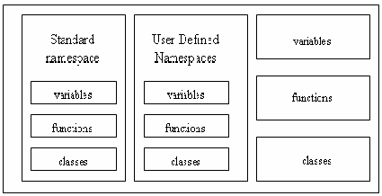
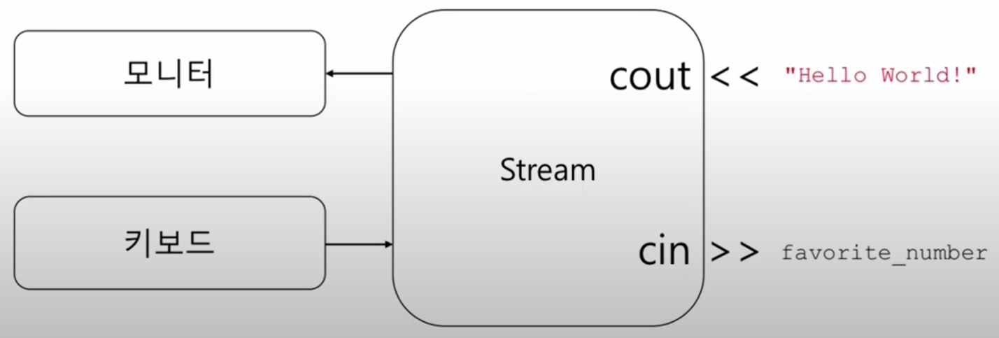

__목차__
- [Print \& Input (입출력)](#print--input-입출력)
- [Preprocessor (전처리기)](#preprocessor-전처리기)
- [Comments (주석)](#comments-주석)
- [main() function](#main-function)
  - [Example code](#example-code)
- [__namespace__](#namespace)
- [(Summary) C++ Program Structure](#summary-c-program-structure)
- [Variable](#variable)
  - [Definition and Initialization](#definition-and-initialization)
  - [Using a Variable](#using-a-variable)
- [Const](#const)

## Print & Input (입출력)
+ print function
  + std::cout << wanted value << ... ;
  + Enter 역할: "/n" or "<< endl;"
+ input funtion
  + std::cin >> wanted value;
```cpp
int favorite_number;

// 입출력
cout << "Enter your favorite number between 1 and 100: ";
cin >> favorite_number;
cout << "Amazing!! That's my favorite number too! " << std::endl;

return 0; // optional
```

## Preprocessor (전처리기)
+ 컴파일 이전에 처리됨
+ "#" 으로 시작
```cpp
#include <iostream>
```

## Comments (주석)
+ 프로그래머가 읽을 수 있는 정보를 제공하기 위함 (협업, 유지보수)
+ 전처리 단계에서 무시되기 때문에 프로그램의 동작과는 무관
+ "//", "/*{긴 코드}*/"

## main() function
+ 모든 C++ 프로그램은 하나의 main함수를 가져야 함
  + 프로그램의 진입점: 프로그램이 실행되면 가장 먼저 실행되는 함수
  + 리턴값 0이 올바른 프로그램 실행을 의미함(지금은 생략해도 무방)
+ 두 가지 버전
  + int main()
    ```cpp
    int main(){}
    ```
    + program.exe
  + int main(int argc, int *argv[])
    ```cpp
    int main(int argc, int *argv[]){}
    ```
    + program.exe
      + argument1
      + argument2

### Example code
```cpp
// 전처리기
#include <iostream>

// namespace
using namespace std;

// main문
int main()
{
    int favorite_number;

    // 입출력
    cout << "Enter your favorite number between 1 and 100: ";
    cin >> favorite_number;
    cout << "Amazing!! That's my favorite number too! " << std::endl;

    return 0; // optional
}
```

## __namespace__
+ std::cout
+ 충돌 방지를 위함
  + 외부 라이브러리와 구현한 소스 코드간의 이름 충돌 가능성
+ 코드의 "그룹화" 로 이해
  + 서로 다른 namespace로 그룹화하여 충돌을 방지할 수 있음
+ " :: " : scope resolution operator
  
<p align="center">
    </img>
    </img>
</p>


```cpp
#include <iostream>

namespace A
{
    void funtion()
    {
        std::cout << "Function 1";
    }
}
namespace B
{
    void funtion()
    {
        std::cout << "Function 2";
    }
}

int main()
{
    A::function();
    B::function();

    return 0;
}
```

## (Summary) C++ Program Structure
+ 빌드 프로세스
+ 오류의 종류
+ 기본 구조, 기능과 용어
  + 키워드 / 지시자 / 연산자
  + 전처리 지시문
  + main() 함수
  + 주석
  + Namespace
  + 표준 입출력

## Variable
+ 메모리의 주소에 붙이는 이름
+ 변수를 만들면, 메모리 변수를 위한 공간(바이트)이 확보됨
  + 공간의 크기(몇칸)는 변수의 타입에 따라 결정
+ 변수에 값을 대입하면, 해당 공간에 값이 기록됨
+ 변수를 만든다 -> 변수를 정의한다고 표현

### Definition and Initialization
+ 변수의 정의 
  + (C++에서는) 변수를 정의할 때는 반드시 타입을 명시해야 함
    ```cpp
    char a;
    int age;
    double rate;
    std::string name;
    ```
+ 변수의 초기화
  + 변수를 정의하면서 초기값을 설정하는 것을 초기화라고 함
    ```cpp
    char a = 10;
    int age = 24;
    double rate = 0.85;
    std::string name = "Hyeonho Cho";
    ```

### Using a Variable
+ 변수의 사용
  + 변수가 정의된 이후에는 해당 메모리에 접근하기 위해 사용됨
  + 메모리에 값을 읽고 쓰는 것이 변수의 사용임
    ```cpp
    a = 20; // 메모리 내 a변수 위치에 20을 쓰기
    std::cout << a; // 메모리 내 a변수 위치의 값을 읽어서 출력
    ```

+ 법칙
  + 이름 앞에 타입(ex. int, float)이 붙어있다? -> 변수의 정의
  + 이름 앞에 아무것도 없다? -> 변수의 사용

## Const
+ 상수
  + 변수와 유사하지만, 초기화 이후 변할 수 없는 값
  + 사용 목적 -> 실수 방지, 프로그램의 변고함
+ 상수의 종류
  + 리터럴 상수: 12, 3.14, "Hyeonho Cho" (r-values)
  + 선언상수
  + 상수표현
  + 열거형
  + Defined

  ```cpp
  // 선언상수
  const int favortie_number = 50;

  // 상수표현
  constexpr int age = 20;

  // defined
  #define pi 3.1415926
  ```