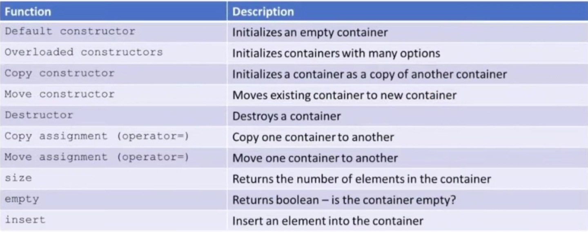
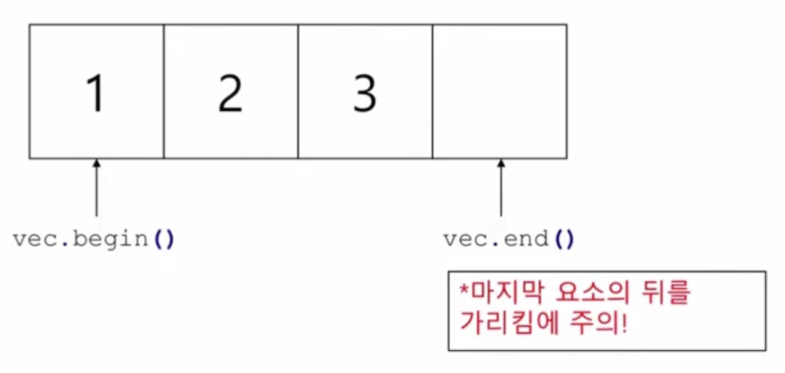
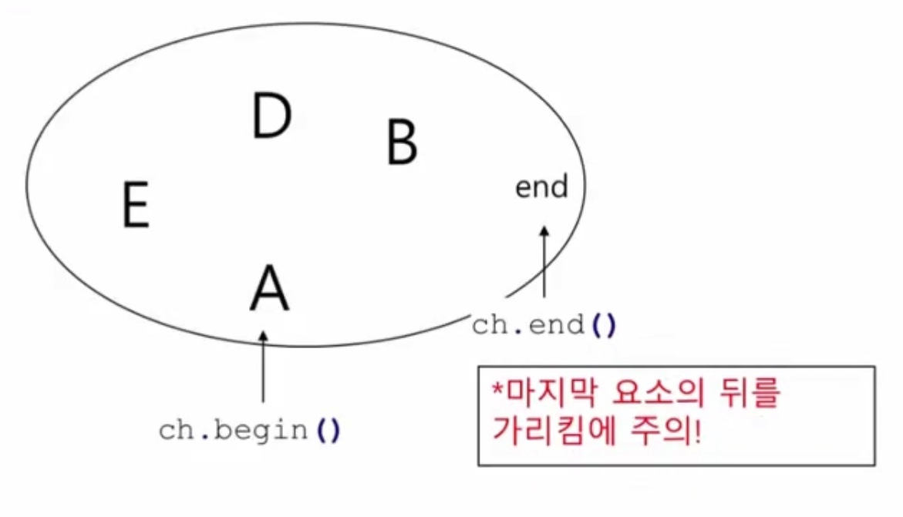
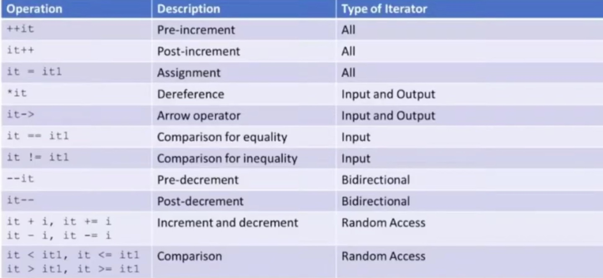
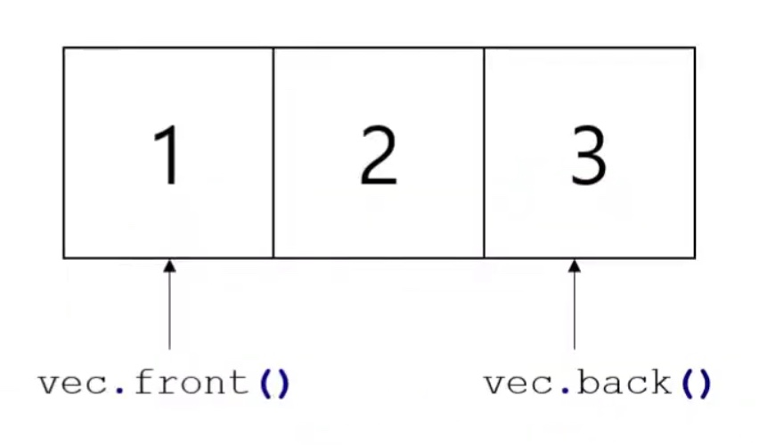
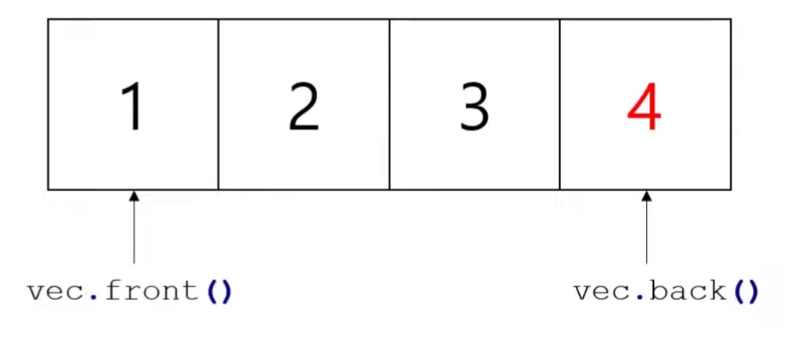
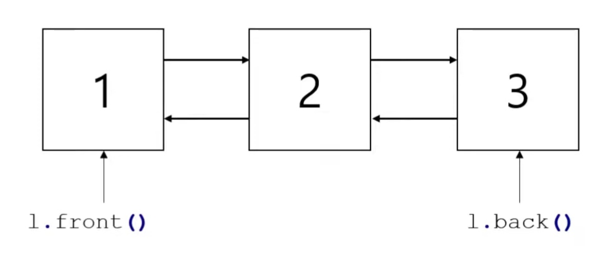

__목차__
- [STL](#stl)
  - [STL 개요](#stl-개요)
    - [구성요소](#구성요소)
    - [컨테이너](#컨테이너)
    - [컨테이너의 공통 기능](#컨테이너의-공통-기능)
  - [STL 반복자(iterator)](#stl-반복자iterator)
    - [반복자의 선언](#반복자의-선언)
    - [반복자의 begin과 end](#반복자의-begin과-end)
    - [반복자의 초기화](#반복자의-초기화)
    - [__Auto 키워드__](#auto-키워드)
    - [반복자의 연산자](#반복자의-연산자)
    - [반복자의 사용](#반복자의-사용)
    - [역 반복자(reverse iterator)](#역-반복자reverse-iterator)
    - [기타 반복자들](#기타-반복자들)
  - [STL Algorithms](#stl-algorithms)
    - [Algorithm Example](#algorithm-example)
      - [Example 1: find](#example-1-find)
      - [Example 2: for\_each](#example-2-for_each)
        - [Functor의 사용](#functor의-사용)
        - [function pointer의 사용](#function-pointer의-사용)
        - [lambda dexpression의 사용](#lambda-dexpression의-사용)
  - [STL Container - Sequential Container](#stl-container---sequential-container)
    - [Array](#array)
      - [Array의 초기화 및 대입](#array의-초기화-및-대입)
      - [Array의 주요함수들](#array의-주요함수들)
    - [**Vector**(자주 사용하는 Container)](#vector자주-사용하는-container)
      - [front / back](#front--back)
      - [push\_back](#push_back)
      - [vector의 주요 함수들](#vector의-주요-함수들)
    - [List](#list)
      - [list의 초기화 및 대입](#list의-초기화-및-대입)
      - [List의 주요 함수들](#list의-주요-함수들)
  - [STL Container - Associative Container](#stl-container---associative-container)
    - [Set](#set)
      - [set의 초기화 및 대입](#set의-초기화-및-대입)
      - [set의 주요 함수들](#set의-주요-함수들)
      - [Other](#other)
    - [Map](#map)
      - [map의 초기화 및 대입](#map의-초기화-및-대입)
      - [map의 주요 함수들](#map의-주요-함수들)
      - [Other](#other-1)
  - [(Summary) STL](#summary-stl)

# STL
## STL 개요
+ 템플릿을 사용해 구현된 컨테이너의 집합
  + STL = Standard Template Library

+ 널리 사용되는 자료구조와 알고리즘이 구현되어 있음
+ 시간 복잡도는 레퍼런스 문서에서 찾아 볼 수 있음
+ Powerful, reusable, adaptable, generic, HUGE!

### 구성요소
+ __컨테이너__(데이터를 저장하기 위한 객체)
  + 객체 또는 기본 자료형의 집합

  + array, vector, deque, stack, set, map, etc.

  + 각 컨테이너는 관련된 헤더 파일 포함 필요(#include <컨테이너이름>)

+ __알고리즘__
  + 컨테이너의 요소들을 다루기 위한 알고리즘

  + find, max, count, accumulate, sort, etc.

+ __반복자 (iterators)__
  + 컨테이너의 요소들에 대한 순회 및 접근

  + forward, reverse, by value, by reference, constant, etc.

### 컨테이너
+ Sequential 컨테이너
  + 삽입 순서를 유지하는 컨테이너
  + array, vector, list, forward_list, deque
+ Associative 컨테이너
  + 순서가 없거나, 미리 정해진 규칙에 따라 저장하는 컨테이너
  + set, multi set, map, multi map
+ 컨테이너 어댑터
  + 다른 컨테이너들의 변형 응용
  + stack, queue, priority queue

### 컨테이너의 공통 기능
<p align="center">
    </img>
</p>

이미 구현되어 있는 것들 잘 사용하면 됨

+ 요소는 복사되어 컨테이너에 저장됨
  + 기본 자료형은 모두 OK
+ __사용자 정의 자료형(클래스)은 복사가 가능하고, 대입이 가능해야 함__
  + __즉, 복사 생성자 / 대입 연산자 필요! <- 포인터 멤버 변수가 없을 때는 OK__
+ __Associative 컨테이너의 경우, 비교 연산을 수행할 수 있어야 함__
  + __즉, operator<, operator== 오버로딩 필요!__


## STL 반복자(iterator)
+ 컨테이너의 요소에 대해 "추상적"인 접근을 가능하게 하는 기능
  + 추상적 -> 컨테이너가 무슨 종류인지, 어떻게 구현되어 있는지 알 필요 없음
+ 포인터와 유사하게 사용 가능
+ 대부분 컨테이너는 반복자를 사용해 순환(traverse) 기능
  + stack, queue는 예외

### 반복자의 선언
+ 반복자가 사용될 컨테이너의 타입과 컨테이너 내 요소의 자료형을 명시적으로 표기
```cpp
vector<int>::iterator it1;

list<string>::iterator it2;

map<string, string>::iterator it3;

set<char>::iterator it4;
```

### 반복자의 begin과 end
```cpp
vector<int> vec {1,2,3};
```
<p align="center">
    </img>
</p>

+ set은 순서가 없음, indexing으로 접근 불가
```cpp
set<char> ch {'A', 'E', 'D', 'B'};
```
<p align="center">
    </img>
</p>

### 반복자의 초기화
```cpp
vector<int> vec{ 1,2,3 }; // 벡터 컨테이너의 선언

vector<int>::iterator it = vec.begin(); // 벡터 컨테이너의 반복자의 선언 및 초기화

auto it = vec.begin(); // 벡터 컨테이너의 반복자의 효율적인 선언 및 초기화 문법!
```

### __Auto 키워드__
+ 자동으로 타입을 추정해주는 키워드
+ 타입이 길어질 경우 사용하면 편리
  + 남용할 경우 사용하면 편리
```cpp
int Add(int a, int b)
{
    return a + b;
}

int main()
{
    int a = 5;
    auto b = 5; // b is int
    auto c = b; // c is int

    auto d = Add(2, 3); // d is int
}
```

### 반복자의 연산자
<p align="center">
    </img>
</p>

```cpp
std::vector<int> vec{ 1,4,7 }; // container

auto it = vec.begin();

it += 2; // 두 칸 뒤의 데이터: 7

cout << *it << endl; // 7
```

### 반복자의 사용
+ while문과 반복자를 사용한 vector 순환
```cpp
vector<int> vec{1,2,3};

vector<int>::iterator it = vec.begin();

while(it != vec.end())
{
    cout << *it << " ";
    ++it;
}

// 1 2 3
```

+ for문과 반복자를 사용한 vector 순환
```cpp
vector<int> vec{1,2,3};

for (auto it = vec.begin(); it != vec.end(); it++)
{
    cout << *it << " ";
}

// 1 2 3
```

+ while문과 반복자를 사용한 set 순환

이전과 동일한 방식(추상화)으로 동작함을 알 수 있음
```cpp
std::set<char> mySet{ 'A', 'B', 'D' };

for (std::set<char>::iterator it = mySet.begin(); it != mySet.end(); it++)
{
	  cout << *it << " ";
}

// A B D
```

### 역 반복자(reverse iterator)
+ 역순으로 동작
+ 마지막 요소가 첫 요소가 되는 반복자
+ ++ 및 --를 반대 방향으로 생각
```cpp
vector<int> vec{1,2,3};

// iterator 대신 reverse_iterator를 사용함으로써, 동일한 방식으로 반대 방향 순환을 수행함
vector<int>::reverse_iterator it = vec.rbegin();
while (it != vec.rend())
{
    cout << *it << " ";
    ++it;
}

// 3 2 1
```

### 기타 반복자들
  + iterator -> begin() / end()
  + const_iterator -> cbegin() / cend()
```cpp
for (auto it = vec.cbegin(); it != vec.cend(); it++)
{
	  *it = 1; // ERROR! const -> vec의 값을 바꿀 수 없음
}
```
  + reverse_iterator -> rbegin() / rend()
  + const_reverse_iterator -> crbegin() / crend()


## STL Algorithms
+ STL의 알고리즘
  + 반복자에 의해 지정된 요소 집합에 대해 수행되는 알고리즘
  + 매우 다양한 알고리즘이 구현되어 있음
    + https://en.cppreference.com/w/cpp/algorithm
  + __알고리즘을 사용하기 위해 함수를 인자로써 제공해야 하는 경우가 존재__

  + __함수를 인자로써 제공하는 방법__
    + __Functor__
    + __Function pointer__
    + __Lambda expression(C++ 11)__

+ 알고리즘과 반복자
  + #include <algorithm>
  + 컨테이너에 따라서 적용할 수 있는 알고리즘이 다름
  + __모든 알고리즘은 반복자를 인자로 필요로 함__
+ 반복자의 유효성
  + 반복자가 유효하지 않을 수 있음
  + 예를 들어, iterator가 가리키고 있는 요소가 삭제된다면?
    + iterator가 유효하지 않아짐

### Algorithm Example
#### Example 1: find
+ find 알고리즘은 컨테이너 내 어떤 요소가 첫 번째로 나타는 지점을 찾아줌

+ 해당 지점을 가리키는 반복자를 반환하거나, end()를 반환함
  + end()를 반환하는 경우, 해당 요소가 컨테이너 내에 없다는 뜻


```cpp
#include <algorithm>

using namespace std;

int main()
{
    std::vector<int> vec{ 1,3,7,4,8,10 };

    // begin에서 부터 end까지의 범위에서 4를 찾아서 해당 위치의 반복자를 location에 저장
    auto location = std::find(vec.begin(), vec.end(), 4);

      if (loc != vec.end()) // success
      {
          cout << *location << endl; // 4
      }
}
```

Cannot Found
```cpp
std::vector<int> vec{ 1,3,7,4,8,10 };

auto location = std::find(vec.begin(), vec.end(), 2);
if (location == vec.end()) // 못찾음
{
    cout << "cannot Found" << endl;
}
else
{
    cout << "Found!" << endl;
    cout << *location << endl;
}
```

+ find 알고리즘의 사용을 위해서는 요소들을 비교할 수 있어야 함

+ operator==이 사용되므로, 클래스의 경우 오버로딩이 필요
  + 오버로딩이 되어있어야만 아래 코드처럼 사용 가능

int, double은 자동적으로 operator==가 오버로딩 되어 있지만 사용자가 정의한 class의 경우에는 operator==에 대한 오버로딩이 되어 있어야 비교가 가능함
```cpp
vector<Player> team {...};
Player p{"Hello", 100, 12};

auto loc = find(team.begin(), team.end(), p);

if (loc != vec.end())
{
    cout << *loc << endl;
}
```

#### Example 2: for_each
+ for_each 알고리즘은 컨테이너 내 각 요소를 인자로 함수를 호출

+ 컨테이너의 각 요소를 제곱하는 경우의 예제
+ 함수를 인자로 넘기는 방법
  + functor
  + function pointer
  + __lambda expression__

##### Functor의 사용
  + 함수(처럼 사용 가능한) 객체
    + ( ) 연산자의 오버로딩
```cpp
struct Func
{
    void operator()(int x)
    {
      cout << x * x << endl;
    }
};

int main()
{
    Func f;
    f.operator()(3); // f(3) --> f.operator()(3)
            // f[3] --> f.operator[](3)
    f(3); // 함수처럼 사용 가능한 객체
}
```

```cpp
// Functor의 정의
struct Square_Functor
{
    void operator()(int x) // ( )연산자 오버로딩
    {
        cout << x*x << " ";
    }
};

vector<int> vec{1,2,3,4};
Square_Functor square; // function object

// Functor 객체를 인자로 넘겨줌으로써, Function 안에 구현된 operator() 함수를 각 요소에 대해 호출함
for_each(vec.begin(), vec.end(), square);
```

##### function pointer의 사용
+ 함수의 주소값을 인자로 전달
+ square()와 square의 차이?
  + 함수의 호출 / 함수의 주소값
```cpp
void square(int x)
{
    cout << x * x << " ";
}

vector<int> vec{1,2,3,4};

// 함수 코드의 주소를 인자로 넘겨줌으로써, 해당 함수를 각 요소에 대해 호출함
for_each(vec.begin(), vec.end(), square);
```

##### lambda dexpression의 사용
+ 익명 함수
+ 함수에 이름을 부여하지 않고, 한번 사용하고 버리는(?) 함수 구현에 사용
+ 구현 방법은 아래 문서들을 참고
  + '[ ]' <- 캡처 절, lambda-introducer (scope 외부 변수를 값으로, 또는 참조로 접근하는지를 명시)
  + https://en.cppreference.com/w/cpp/language/lambda
  + https://modoocode.com/196

```cpp
vector<int> vect{ 1,2,3,4 };
std::for_each(vec.begin(), vec.end(),
    [](int x) { cout << x*x << " "; }) // lambda
// 1 4 9 16
```

## STL Container - Sequential Container
+ https://en.cppreference.com/w/cpp/container

+ Sequence 컨테이너
  + 삽입 순서를 유지하는 컨테이너
  + __array, vector, deque, list, forward_list__
+ Associative 컨테이너
  + 순서가 없거나, 미리 정해진 규칙에 따라 저장하는 컨테이너
  + __set, multi set, map, multi map__
+ 컨테이너 어댑터
  + 다른 컨테이너들의 변형 응용
  + __stack, queue, priority queue__

### Array
+ std::array (C++ 11)
+ #include <array.> (.은 무시)
+ 고정 크기 배열
+ 기존의 정적 배열(raw array) (ex. int arr[5] = {1,2,3,4,5})과 거의 유사함
+ 요소에 대한 직접 접근(constant time)
+ STL이므로, iterator와 algorithm을 사용 가능
+ 특별한 이유가 없으면, raw array 대신 STLarray를 사용

#### Array의 초기화 및 대입
```cpp
array<int, 5> arr1 { {1,2,3,4,5} }; // C++11 style
array<int, 5> arr1 {1,2,3,4,5}; // c++14 style

array<string, 3> names{
    "kim",
    "Lee",
    "Park"
};

arr1 = {2,4,6,8,10};
```

#### Array의 주요함수들
1. size, at, [ ], front, back
  ```cpp
  array<int, 5> arr{ 1,2,3,4,5 };

  cout << arr.size(); // 5 (배열의 현재 크기 반환)

  cout << arr.at(0); // 1 (배열의 0번째 인덱스 값을 반환)
  cout << arr[1]; // 2 (배열의 1번째 인덱스 값을 반환)

  cout << arr.front(); // 1 (배열의 0번째 인덱스 값을 반환)
  cout << arr.back(); // 5 (배열의 마지막 인덱스 값을 반환)
  ```

2. empty, max_size, fill, swap, data
```cpp
array<int, 5> arr {1,2,3,6,9};
arry<int, 5> arr1 {10,20,30,40,50};

cout << arr.empty(); // 0(false) (배열에 요소가 있다면 false를, 없다면 true를 반환)
cout << arr.max_size(); // very large number (배열의 최대 크기 반환)

cout << arr.fill(10); // (배열의 모든 요소를 10으로 채움)
arr.swap(arr1); // (두 배열을 swap), 두 배열의 사이즈와 타입이 같아야 함
int *data = arr.data(); // (배열의 주소를 반환)
```
특히 .size()는 유용히 쓰임, 예를 들어
```cpp
array<int, 5> arr {1,2,3,6,9};

for (int i=0; i<arr.size(); i++)
{
    cout << arr[i] << endl;
}
```

### **Vector**(자주 사용하는 Container)
+ std::vector
+ #include <vector.> (.은 무시)

+ __가변__ 크기 배열
+ 요소에 대한 직접 접근(constant time)
+ 요소의 끝 위치 삽입(push_back) 및 제거(pop_back) (constant time)
+ 임의의 위치에 요소의 삽입 및 제거 (linear time)
+ 반복자가 유효하지 않을 수 있음

#### front / back
```cpp
vector<int> vec{1,2,3};
```
<p align="center">
    </img>
</p>

front와 back은 주소값이 아닌 value라는 것에 유의

back이 가리키는 곳은 end가 아님에 유의(end는 한칸 더 뒤)

#### push_back
```cpp
vec.push_back(4);
```
<p align="center">
    </img>
</p>
array는 size가 불변인 반면 vector는 size를 변화시킬 수 있음


#### vector의 주요 함수들
1. size, capacity, at, front, back, etc.
```cpp
std::vector<int> vec{ 1,2,3,4,5 };

std::cout << vec.size() << std::endl; // 5
std::cout << vec.capacity() << std::endl; // 5

std::cout << vec[0] << std::endl; // 1
std::cout << vec[1] << std::endl; // 2
std::cout << vec.at(3) << std::endl; // 4
std::cout << vec[-1] << std::endl; // Runtime Error - 해결할 수 없는 오류
std::cout << vec.at(-1) << std::endl; //  Exception - 해결할 수 있는 오류, 좀더 안전한 방법

std::cout << vec.front() << std::endl; // 1
std::cout << vec.back() << std::endl; // 5
```

2. __push_back, pop_back, emplace_back__
```cpp
Person p1 {"kim", 34};
vector<Person> vec;

vec.push_back(p1); // add p1 to the back, copy
vec.pop_back(); // remove p1 from the back

vec.push_back( Person{"Lee", 20} );
vec.emplace_back("Lee", 20); // more efficient
```

3. empty, swap, sort
```cpp
vector<int> vec1 { 4,2,1,5,10 };
vector<int> vec2 { 10,20,30,40,50 };

cout << vec1.empty(); // 0(false)
vec1.swap(vec2); // swap 2 vector: vec1 <-> vec2

// vec2.begin() ~ vec2.end()까지를 크기 순서대로 정렬
sort(vec2.begin(), vec2.end());
for (int i = 0; i < vec2.size(); i++)
{
    std::cout << vec2[i] << " "; // 1 2 4 5 10
}
```

4. insert
```cpp
std::vector<int> vec{ 1,2,3,4,5 };

// 어디에 숫자를 넣을 지 찾음 (4 앞에)
auto it = std::find(vec.begin(), vec.end(), 4);
vec.insert(it, 7);

std::cout << vec[3] << std::endl;
```

### List
```cpp
list<int> l{ 1,2,3 };
```
<p align="center">
    </img>
</p>

#### list의 초기화 및 대입
```cpp
list<int> l1{ 1,2,3,4,5 };
list<int> l2{ 10,100 };

list<string> names { "Kim", "Lee", "Park" };

l1 = { 2,4,6,8,10 };
```

#### List의 주요 함수들
1. size, max_size, front, back
```cpp
std::list<int> l1{ 1,2,3,4,5 };

std::cout << l1.size(); // 5
std::cout << l1.max_size(); // very large number

std::cout << l1.front(); // 1
std::cout << l1.back(); // 5
```

2. push_back, pop_back, push_front, pop_front, push_back, emplace_back
```cpp
Person p1 {"kim", 20};
vector<Person> l;

l.push_back(p1); // add p1 to the back, copy
l.pop_back(); // remove p1 from the back

// vector에는 존재 x
l.push_front(Person{ "Lee", 21 });
l.pop_front(); // remove front element

l.push_back( Person{"Lee", 20} ); // efficient add to back
l.emplace_back("Lee", 20); // efficient add to front
```

3. find, insert, erase, resize
```cpp
void PrintList(std::list<int> myList)
{
    for (auto it1 = myList.begin(); it1 != myList.end(); it1++)
    {
        std::cout << *it1 << " ";
    }
    std::cout << std::endl;
}

int main()
{   
    std::list<int> myList{ 1,2,3,4,5 };
    PrintList(myList); // 1 2 3 4 5

    std::cout << myList[2] << std::endl; // ERROR!

    auto it = std::find(myList.begin(), myList.end(), 3);

    myList.insert(it, 10);
    PrintList(myList); // 1 2 10 3 4 5

    myList.erase(it); 
    PrintList(myList); // 1 2 10 4 5

    myList.resize(2); // 1 2

    myList.resize(5) // 1 2 0 0 0
}
```

4. find, ++, --
```cpp
list<int> l1{ 1,2,3,4,5 };

auto it = find(l1.begin(), l1.end(), 3);

cout << *it; // 3
it++;
cout << *it; // 4
it--;
cout << *it; // 3
```


## STL Container - Associative Container
+ Sequence 컨테이너

+ 연속된 메모리 공간에 저장되지 __않음__
  + 요소에 대한 __직접 접근 불가(.at( ) 또는 [ ]로 접근 불가)__
+ 요소의 위치가 결정되면, 삽입과 삭제가 매우 효율적

+ std::list (C++ 11)
+ #include <list.> (.은 무시)

+ 가변 크기
  + 양방향 연결 리스트
+ 요소에 대한 직접 접근 불가
+ 임의의 위치에 빠른 삽입과 삭제(constant time)
  + 특정 요소를 검색(find)하는 데는 linear time
+ 반복자 유효성 보장 안됨


### Set
+ Associative 컨테이너
  + Key를 사용한 빠른 데이터 검색이 가능
  
  + 주로 Balanced binary tree 또는 hashset으로 구현됨
  + 대부분의 연산이 빠르게 이루어짐

+ Set
  + Set
  + Unordered_set
  + Multiset

  + Unordered_multiset

+ std::set
+ #include <set.> (.은 무시)

+ 집합과 유사(중복된 요소 없음)
+ key에 따라 정렬
+ 요소에 대한 직접 접근 불가
+ 반복자가 유효하지 않을 수 있음

#### set의 초기화 및 대입
```cpp
set<int> s{ 1,2,3,4,5 };
set<string> names{ "Kim", "Lee", "Park" };

s = { 2,4,6,8,10 };
```

+ List와 Set의 차이
```cpp
template <typename T>
void PrintContainer(T myContainer)
{
    for (auto it1 = myContainer.begin(); it1 != myContainer.end(); it1++)
    {
        std::cout << *it1 << " ";
    }
    std::cout << std::endl;
}

int main()
{
    std::list<int> l{ 3,1,5,4,2 };
    PrintContainer<std::list<int>>(l); // 3 1 5 4 2

    std::set<int> s{ 3,1,5,4,2 };
    PrintContainer<std::set<int>>(s); // 1 2 3 4 5 <-- key에 따라 정렬됨
}
```

#### set의 주요 함수들
1. size, max_size, insert
```cpp
set<int> s{ 4,1,1,3,3,2,5 }; // 1 2 3 4 5

cout << s.size(); // 5, 길이 또한 마찬가지
cout << s.max_size(); // very large number

// no front or back

s.insert(7); // 1 2 3 4 5 7
```
2. insert
```cpp
Person p1{ "Kim", 20};
Person p2{ "Lee", 21};

set<Person> names;

names.insert(p1); // add p1 to the set
auto result = names.insert(p2); // add p2 to the set
```
+ __정렬을 위해 operator< 오버로딩 필요!__
+ insert의 결과로 pair<iterator, bool> 반환

  + iterator는 삽입된 위치, 또는 이미 존재하는 요소를 가리키는 반복자 반환

  + Bool은 성공 또는 실패 결과 반환

3. erase, find
```cpp
set<int> s{ 1,2,3,4,5 };

s.erase(3); // 1 2 4 5

auto it = s.find(5); // Algorithm의 find 함수가 아닌, set의 멤버 변수인 find
if(it != s.end())
    s.erase(it); // 1 2 4
```

4. count, clear, empty
```cpp
set<int> s{ 1,2,3,4,5 };

int num = s.count(1); // 0 or 1

s.clear(); // remove all elements

s.empty(); // true or false
```

#### Other
+ multiset
  + Key로 정렬
  + 요소의 중복 허용
+ unordered_set
  + 요소의 중복 불가
  + 요소가 정렬되지 않음
  + 요소의 수정 불가
+ unordered_multiset
  + 요소가 정렬되지 않음
  + 요소의 중복 허용


### Map
+ Associative 컨테이너
  + Ket를 사용한 빠른 데이터 검색이 가능
  + 주로 Balanced binary tree 도는 hashset으로 구현됨
  + 대부분의 연산이 빠르게 이루어짐
+ Map
  + Map
  + Unordered_map
  + Multimap
  + Unordered_multimap

+ std::map
+ #include <map.> (.은 무시)
+ Dictionary(사전)과 유사
+ 요소가 key-value 쌍으로 저장됨
+ Key 값에 따라 정렬
+ Key는 유일한 값으로 중복 불가
+ Key를 통한 직접 접근 가능
+ 반복자가 유효하지 않을 수 있음

#### map의 초기화 및 대입
```cpp
std::map<std::string, int> m1
{
    {"Hyeonho", 24}, // {key, value}
    {"Lee", 21},
    {"Hyeonho", 21} // 중복 불가, 첫번째 Hyeonho에 대한 정보만 남음
};

std::cout << m1["Hyeonho"] << std::endl; // 24
m1["Hyeonho"] = 25;
std::cout << m1["Hyeonho"] << std::endl; // 25

// new Key, value
m1.insert(std::make_pair("Choi", 30)); // insert
m1["Park"] = 23;
std::cout << m1["Choi"] << std::endl; // 30
std::cout << m1["Park"] << std::endl; // 23
```

#### map의 주요 함수들
1. size, max_size
```cpp
std::map<std::string, int> m
{
    {"Kim", 20},
    {"Cho", 24}
};

cout << m.size() << endl; // 2
cout << m.max_size() << endl; // very large number

// No front or back
```
2. pair, insert, make_pair
```cpp
map<string, string> m2 {
    {"Kim", "student"},
    {"Lee", "professor"}
};

std::pair<string, string> p1 { "park","assistant" };

m2.insert(p1);

m2.insert(std::make_pair("Choi", "employee"));
```

3. [ ], at
```cpp
map<string, string> m2 {
    {"Kim", "student"},
    {"Lee", "professor"}
};

m2["Park"] = "assistant"; // insert

m2["Park"] = "employee"; // update value
m2.at("Park")  = "student"; // update value
```

4. erase, find, 
```cpp
map<string, string> m2 {
    {"Kim", "student"},
    {"Lee", "professor"}
};

m2.erase("Kim");

if (m2.find("Lee") != m2.end())
    cout << "found lee!";

auto it = m2.find("Lee");
if (it != m2.end())
    m.erase(it); // Lee를 찾았으면 지움
```

5. count, clear, empty
```cpp
map<string, string> m2 {
    {"Kim", "student"},
    {"Lee", "professor"}
};

int num = m2.count("Kim"); // 0 or 1

m2.clear(); // remove all elements

m2.empty(); // true or false
```

#### Other
+ multimap
  + #include <map.>에 포함되어 있음
  + 중복된 요소를 허용
+ unordered map
  + #inlcude <unordered_map>
  + 요소가 정렬되지 않음
+ unordered multimap
  + #include <unordered_map>에 포함
  + 요소가 정렬되지 않음
  + 중복된 요소를 허용

## (Summary) STL
+ 구성요소
  + __컨테이너__
    + 객체 또는 기본 자료형의 집합
  
    + array, __vector__, deque, stack, set, __map__, etc.
    + 각 컨테이너는 관련된 헤더 파일 포함 필요 (#include <컨테이너 이름>)

  + __알고리즘__
    + 컨테이너의 요소들을 다루기 위한 알고리즘
    + iterator의 사용이 필수적

    + find, max, count, accumulate, sort, etc.
  + __반복자 (iterators)__
    + 컨테이너의 요소들에 대한 순회 및 접근

    + forward, reverse, by value, by reference, constant, etc.