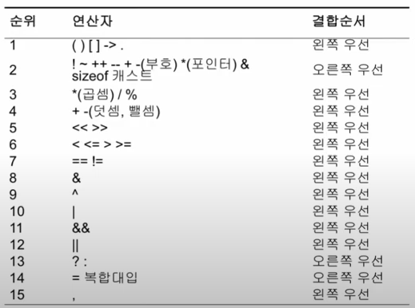

__목차__
- [Array (배열)](#array-배열)
  - [Defining Arrays](#defining-arrays)
  - [Initializing Arrays](#initializing-arrays)
  - [Accessing Array Elements](#accessing-array-elements)
  - [(Summary) Arrays](#summary-arrays)
- [Operations](#operations)
  - [(Summary) Statements and Operators](#summary-statements-and-operators)
- [Controlling flow](#controlling-flow)
  - [if 문](#if-문)
  - [swith 문](#swith-문)
  - [?: 연산자](#-연산자)
  - [Looping statement](#looping-statement)
  - [for 문](#for-문)
  - [while 문](#while-문)
    - [continue](#continue)
    - [break](#break)
  - [(Summary) Controlling flow](#summary-controlling-flow)
- [Debugging in visual studio](#debugging-in-visual-studio)

# Array (배열)
+ 배열
  + 복합(compound) 데이터 타입
  + 동일한 타입인 요소들의 집합
+ 개별 요소들에 직접적이 접근이 가능
+ 사용 목적
  + 아래와 같은 코드를 효율적으로 바꿀 수 있음
```cpp
int score_1 = 0;
int score_2 = 0;
int score_3 = 0;
...
int score_100 = 0; // 비효율적
```
```cpp
int score[100] = 0; // 효율적
```
+ 특징
  + 고정된(정해진) 길이
  + 인덱스를 통해 접근 가능
  + 인덱스는 0부터 시작하며, 마지막 인덱스는 (size-1)
  + 초기화 필요

## Defining Arrays
  + 기본 형
    ```cpp
    ElementType array_name [constant number of elements];
    ```
  + 정의 예
    ```cpp
    int scores[5];

    const int days_in_years = 365;
    double temperature [days_in_years];
    ```
## Initializing Arrays
```cpp
int scores[5] = { 100, 85, 21, 56, 70 };

int high_scores[10] = { 3, 5 }; // 3, 5 and remaining 0

const int days_in_years = 365;
double temperature [days_in_years] = {0}; // all to zero

int my_array[] = {1, 2, 3, 4, 5}; // automatic sizing
```

## Accessing Array Elements
+ 배열 내의 요소들에 대한 접근( = 사용, = 읽고 쓰기)
  ```cpp
  array_name[elemnt_index]
  ```
  ```cpp
  int scores[5] = { 100, 85, 21, 56, 70 };

  cout << "first score : " << scores[0] << endl;
  cout << "second score : " << scores[1] << endl;
  cout << "third score : " << scores[2] << endl;
  cout << "fourth score : " << scores[3] << endl;
  cout << "fifth score : " << scores[4] << endl;
  ```
+ 요소들은 개별적인 주소를 갖고 있으므로 변수와 동일하게 값 수정 가능
```cpp
cin >> scores[0];

scores[1] = 40;
```

## (Summary) Arrays
+ 배열 (동일한 타입 요소들의 집합, 고정된 길이)
  + 개요
  + 선언과 초기화 - (고정 크기 선언, 리스트 초기화 "{ }")
  + 접근 - (인덱스 기반 접근)

# Operations
+ 대입 연산자
  ```cpp
  lhs = rhs
  ```
  + l-value & r-value
  + 오른쪽의 값을 계산하여 왼쪽에 대입
  + 컴파일러가 대입 가능한지 체크함
    ```cpp
    int num1 = 0;
    num1 = "Hyeonho Cho";
    ```
  + 왼쪽은 대입이 가능해야 함(ex. 리터럴, 상수는 될 수 없음)
+ 산술 연산자
  + +, -, *, /, %(mod)
+ 증감 연산자
  + Prefix (++num, --num) (대입 전 증감)
  + Postfix (num++, num--) (대입 후 증감)
+ 비교 연산자
  + ==, !=
  + 결과는 Boolean 타입의 true or false
+ 관계 연산자
  + <, >, <=, >=
+ 논리 연산자
  + !, &&, || (not, and, or)
+ 복합 연산자
  ```cpp
  a += 1; // a = a+1;
  a *= b+c; // a = a*(b+c);
  ```
+ 연산자 우선순위
  + 혼동을 없애기 위해 우선순위 괄호표기 하는 것이 좋은 코드!
  <p align="center">
    </img>
  </p>

## (Summary) Statements and Operators
+ 표현 (가장 작은 단위, 리터널, 변수 등등)
+ 명령문 (코드의 구성 단위, 세미콜론으로 끝을 표기)
+ 연산자
  + 대입 연산자 (l-value = r-value)
  + 산술 연산자 (사칙연산)
  + 증감 연산자 (++, --)
  + 관계 연산자 (>, <, >=, <=)
  + 논리 연산자 (!, &&, ||)
  + 멤버 접근 연산자 (., ->)
  + 기타

# Controlling flow
## if 문
+ 표현식이 참일 경우에만 실행하는 명령문
```cpp
if (Expr)
    statement;

if (num > 10)
    ++num;
```
+ if문과 블록
  + 조건문 내에서 하나 이상의 명령문을 실행하기 위해서는 블록 내에 명령문을 작성
  + 블록 내에서 선언된 변수는 "지역변수"라 하며, 블록 내에서만 접근 가능

+ if - else 문
  + 표현문의 참/거짓 여부에 따라 명령문 실행 분기
  + else if 키워드를 통해 다양한 조건을 기술 가능
    ```cpp
    if (score > 90)
    {
        cout << "A";
    }
    else if (score > 80)
    {
        cout << "B";
    }
    else if (score > 70)
    {
        cout << "C";
    }
    else
    {
        cout << "F";
    }
    ```
  ## swith 문
  + switch, case, default를 사용한 분기문
  + Switch 표현문의 결과는 정수형 리터럴이어야 함(정수, char, 열거형)
  ```cpp
  switch (selection)
  {
      case 1: cout << "1 selected";
          break;
      case 2: cout << "2 selected";
          break;
      case 3: cout << "3 selected";
          break;
      case 4: cout << "4 selected";
          break;
      default: cout << "1,2,3,4 Not Selected";
  }
  ```

## ?: 연산자
  ```cpp
  (conditional_expr) ? exr1 : expr2
  ```
  + conditional_expr은 boolean 표현식
  + 표현식이 거짓이라면 expr2의 값을 리턴
+ if-else 문의 사용과 유사함
+ 삼항 연산자
  ```cpp
  int a=10, b=20;
  int score=92;
  int result{};

  result = (a>b) ? a:b;
  result = (a<b) ? (b-a):(a-b);
  result = (b!=0) ? (a/b):0;
  cout << ((score>90) ? "Excellent!":"Good!");
  ```


## Looping statement
  + 반복문(iteration / repetition)
    + 반복조건 + 명령문
  + 사용 예
    + 특정 횟수만큼 반복이 필요할 때
    + 집합의 각 요소에 대한 연산이 필요할 때
    + 특정 조건이 참일 동안 명령의 수행이 필요할 때
    + 입력 스트림의 끝까지 반복을 수행해야 할 때
    + 무한 반복이 필요할 때
    + 등등..
## for 문
```cpp
for(initialization ; condition ; increment)
{
    statements;
}
```
```cpp
int i=0;

for (i=0; i<5; ++i)
{
    cout << i<< endl;
}
```
```cpp
for (int i=0; i<5; i++)
{
    cout << i << endl;
}

i=10; // ERROR!
```
+ 배열 루프
  ```cpp
  int scores[] = {100,90,50};

  for (int i=0; i<3; i++)
  {
      cout << scores[i] endl;
  }
  ```
+ 콤마 연산자
  ```cpp
  for (int i=0,j=5; i<5; i++,j++)
  {
      cout << i << " * " << j << " : " << i*j << endl;
  }
  ```

## while 문
```cpp
while(expr)
{
    statements;
}
```
```cpp
int i=0;

while(i<5)
{
    cout << i << endl;
    i++; // Important!
}
```
+ boolean flag 사용 예
  ```cpp
  bool is_done=false;
  int number=0;

  while(!is_done)
  {
      cout << "enter number under 10" << endl;
      cin >> number;
      if (number >= 10)
      {
        cout << "wrong number" << endl;
      }
      else
      {
        cout << "OK!" << endl;
        is_done = true;
      }
  }
  ```
### continue
+ Continue문 이후의 문장은 실행되지 않음
+ 다음 iteration으로 곧바로 넘어가기 위해 사용
  
### break
+ Break문 이후의 문장은 실행되지 않음
+ 루프 밖으로 바로 빠져나가기 위해 사용
  ```cpp
  int values[] = { 1,2,-1,3,-1,99,7,8,9};

  for (int i=0; i<9; i++)
  {
      if (values[i] == -99)
        break;
      else if (values[i] == -1)
        continue;
      else
        cout << values[i] << endl;
  }
  ```

## (Summary) Controlling flow
+ 조건문
  + If-else문 (블록, nested)
  + Switch문
  + ?: 연산자
+ 반복문
  + For문
  + While, do-While문
  + Continue, break


# Debugging in visual studio
+ ros2를 사용하게 되면 많이 쓸 듯함.
+ 참조링크
  +  [debugging in visual studio]("https://www.youtube.com/watch?v=pyV6YhYTgTY&list=PLMcUoebWMS1nzhlx-NbD4KBGEP1UCUDF_&index=14")