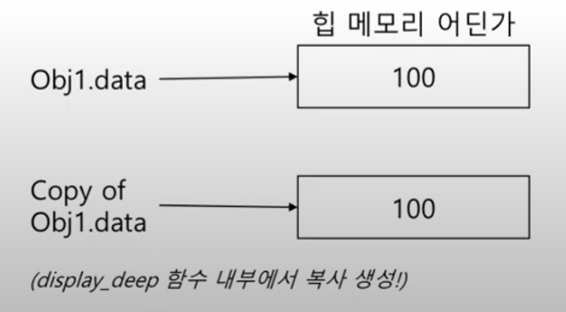

__목차__
- [__Copy Constructor (복사 생성자)__](#copy-constructor-복사-생성자)
  - [Declaring Copy Constructor (복사 생성자의 선언)](#declaring-copy-constructor-복사-생성자의-선언)
  - [Implementing Copy Constructor (복사 생성자의 구현)](#implementing-copy-constructor-복사-생성자의-구현)
    - [얕은 복사 생성자의 구현](#얕은-복사-생성자의-구현)
  - [Shallow vs Deep Copy](#shallow-vs-deep-copy)
    - [얕은 복사의 문제](#얕은-복사의-문제)
    - [__깊은 복사__](#깊은-복사)
    - [(Summary) Copy Constructor](#summary-copy-constructor)
- [this, const, static, friend](#this-const-static-friend)
  - ["this" 포인터](#this-포인터)
  - [__const 객체__](#const-객체)
  - [Static Class Members](#static-class-members)
  - [Friends of a Class](#friends-of-a-class)
  - [(Summary) this, const, static, friend](#summary-this-const-static-friend)

# __Copy Constructor (복사 생성자)__
+ 복사 생성자  
  + 객체가 복사될 때는, 기존 객체를 기반으로 새로운 객체가 생성됨
  + 객체가 복사되는 경우
    1. __객체를 pass by value 방식으로 함수의 매개변수로 전달할 때__
    2. __함수에서 value의 형태로 결과를 반환할 때__
    3. __기존 객체를 기반으로 새로운 객체를 생성할 때__
  + 객체가 어떤 방식으로 복사될 지 정의해 주어야 함
    + 사용자가 구현하지 않는 경우 컴파일러에서 자동으로 복사 생성자를 정의함
+ 왜 중요한가?
  + 복사 과정에서 문제가 발생할 수 있음(포인터가 존재하는 경우)
  + 복사 비용에 대한 인식(클래스는 많은 데이터를 포함시킬 수 있음)

+ 객체가 복사되는 경우
  1. Pass by value로 객체 전달 예시
        ```cpp
        void display_player(Player p)
        {
                // p is a copy of hero
                // use p
        } // destructor for is called

        int main()
        {
                Player hero {0, 0, 1};
                display_player(hero);
        }
        ```
  2. Value의 형태로 결과값 반환
        ```cpp
        Player create_super_enemy() // Player라는 탕입의 함수
        {
                Player an_enemy{1, 1, 1};
                return an_enemy;
        } // 복사된 an_enemy는 return 한 후 지워짐

        int main()
        {
                Player enemy;
                enemy = create_super_enemy(); // 데이터만 enemy에 들어가게 됨
        }
        ```
  3. 기존 객체를 기반으로 새로운 객체를 생성
   
        복사 생성자 호출됨
        ```cpp
        Player hero {1, 1, 1};

        Player another_hero = hero; // another hero is copy of hero
        Player another_hero {hero}; // same meaning
        ```
        복사 생성자가 호출되지 않고 단지 대입한 것! (위와는 다른 의미임)
        ```cpp
        Player hero {1, 1, 1};

        Player another_hero;
        another_hero = hero;
        ```
+ 자동 생성되는 복사 생성자
  + 사용자가 복사 생성자를 구현하지 않으면, **기본 복사 생성자**가 사용
  + 멤버 변수들의 값을 복사하여 대입하는 방식!
  + __포인터 타입의 멤버 변수가 존재할 때는 주의!!__
    + __기본 복사 생성자는 포인터 타입의 변수 또한 복사하여 대입됨__
    + __즉, 포인터가 가리키는 데이터의 복사가 아닌 포인터의 주소값의 복사!__
  + __얕은 복사(shallow copy) vs 깊은 복사(deep copy)__

## Declaring Copy Constructor (복사 생성자의 선언)
  + 동일한 타입의 const 참조자가 인자인 생성자
    ```cpp
    Type::Type(const Type &source);
    ```
    ```cpp
    Player::Player(const Player &source);
    Account::Account(const Account &source);
    ```
## Implementing Copy Constructor (복사 생성자의 구현)
### 얕은 복사 생성자의 구현
+ 자동 생성된 복사 생성자의 행동
+ 성성자 초기화 리스트를 사용한 방법
    
    복사 생성자를 만들어주지 않으면 아래와 같이 자동으로 만들어짐
    
    But 복사를 해줘야지만 제대로 된 값이 복사되어 들어감 (안전빵) 
    ```cpp
    Player (const Player &other)
        : x{ other.x }, y{ other.y }, speed{ other.speed }
    {
    }
    ```
+ 대입을 사용한 방법
    ```cpp
    Player (const Player &other)
    {
        x = other.x;
        y = other.y;
        speed = other.speed;
    }
    ```


    + Example
        ```cpp
        class Player
        {
        public
            Player(int hp, int xp)
                : hp{ hp }, xp{ xp }
            {
                cout << "생성자 호출됨" << endl;
            }
            // 복사 생성자
            Player(const Player& source)
                : hp{ source.hp }, xp{ source.xp }
            {
                cout << "복사 생성자 호출됨" << endl;
            }

            void print()
            {
                cout << hp << " " << xp << endl;
            }
        private:
            int hp;
            int xp;
        };

        void PrintInformation(Player p)
        {
            p.print();
        }

        int main()
        {
            Player p{ 10, 2 };

            // p가 복사되면서 PrintInformation의 인자로 들어감
            PrintInformation(p); // 복사 생성자 호출됨
        }
        ```
## Shallow vs Deep Copy
### 얕은 복사의 문제
+ 포인터가 가리키는 데이터가 아닌 포인터 주소값의 복사!
+ 아래와 같이 구현된 경우 얕은 복사임
    ```cpp
    class Player
    {
    public:
        // 복사 생성자
        Player(int hp, int xp)
            : hp{ hp }, xp{ xp }
        {
            cout << "생성자 호출됨" << endl;
        }

        Player(const Player& source)
            : hp{ source.hp }, xp{ source.xp }
        {
            cout << "복사 생성자 호출됨" << endl;
        }

        void print()
        {
            cout << hp << " " << xp << endl;
        }
    private:
        int hp;
        int xp;
    };

    void PrintInformation(Player p)
    {
        p.print();
    }

    int main()
    {
        int* p1 = new int;
        *p1 = 100;

        int* p2 = p1;

        delete p2;
        delete p1; // 이중 해제
    }
    ```
    Example
    ```cpp
    class Shallow
    {
    public:
        Shallow(int d); // Constructor
        Shallow(const Shallow& source);
        ~Shallow();
    private:
        int* data; // Pointer
    };

    Shallow::Shallow(int d)
    {
        data = new int; // allocate storage
        *data = d;
    }
    Shallow::~Shallow()
    {
        delete data; // free storage
        cout << "free storage" << endl;
    }

    Shallow::Shallow(const Shallow& source)
        : data{ source.data } // Source 객체의 data에 저장된 주소값이 
        // 현재 객체의 data에 복사됨
    {
        cout << "Copy constructor, shallow" << endl;
    }

    void display_shallow(Shallow obj)
    {
        cout << "복사 생성자가 활성화되었습니다" << endl;
    }

    int main()
    {
        Shallow obj1{ 100 };
        display_shallow(obj1); // copy of obj1 is release data
        return 0;
    } // 이중 해제를 하게 됨 (이게 문제!!)
    ```

### __깊은 복사__
+ 포인터 주소를 복사하는 것이 아니라, 데이터를 복사하여 복사 생성
+ 복사 생성자가 __새로운 힙 공간을 할당하여 동일한 데이터 생성__

복사 생성된 객체의 데이터를 저장하기 위해 새로운 힙 메모리 할당

+ 기본 방식
```cpp
Deep::Deep(const Deep &source)
{
    data = new int; // allocate new storage
    *data = *source.data; // dereferencing
    cout << "Copy constructor, deep" << endl;
}
```

+ __추천 방식__
```cpp
Deep::Deep(const Deep &source)
    : data{ new int(*source.data) }
{
    cout << "Copy constructor, deep" << endl;
}
```

+ 생성자 위임을 사용하는 방식 (추천 x)
```cpp
Deep::Deep(const Deep &source)
    : Deep{ *source.data }
{
    cout << "Copy constructor, deep" << endl;
}
```

데이터도 복사하므로 이중 해제의 문제 해결
```cpp
int main()
{
    Deep obj1{ 100 };
    display_deep(obj1); // copy of obj1 is release data
    return 0;
} // obj1 try to release data again!
```

<p align="center">
    </img>
</p>

+ 복사 생성자 잘 사용하는 법
  + 포인터 타입의 멤버 변수가 존재할 때는 (깊은)복사 생성자 직접 구현
    + 새로운 heap 공간을 할당하여 값을 복사해 두어야 한다는 것을 명심
  + STL / __smart pointer__ 사용
    + STL은 내부적으로 안전한 복사 생성자가 구현되어 있음
    + Smart pointer는 복사를 허용하지 않거나(unique) 참조되어 있는 동안은 해제하지 않음(shared)

+ Object in Memory
  + 객체를 메모리에 생성하면 멤버 변수의 값이 스택이나 힙에 저장되는 것
    + 멤버 함수는 코드 공간에 존재하며 접근 제한에 따라 일반 함수처럼 호출될 뿐임
```cpp
class Point
{
private:
    int x;
    int y;
public:
    Point(int x, int y)
        : x{ x }, y{ y }
    {}
};

int main()
{
    Point p{ 2, 3 };
}
```

### (Summary) Copy Constructor
+ 복사 생성자 개요
  + 매개변수 전달, value 반환, 기존 객체로 새 객체 생성시 복사 생성자 호출
+ 기본 복사 생성자
  + 컴파일러가 만들어주는 기본 복사 생성자는 멤버 변수를 그대로 대입(얕은 복사)할 뿐
  + 얕은 복사는 이중 해제 오류 발생
+ 깊은 복사
  + 새로운 힙공간을 할당하여 복사 생성


# this, const, static, friend
## "this" 포인터
+ this는 C++ 키워드
+ 멤버 함수를 호출한 객체의 주소값
+ 사용 예

```cpp
void Player::SetPosition(int x, int y)
{
    x = x; // 명확하지 않음
    y = y; // 명확하지 않음
}

// this로 명확히 함
void Player::SetPosition(int x, int y)
{
    this->x = x; // 주소값이므로 '->'을 사용해야 함
    this->y = y;
}
```
```cpp
class Player
{
private:
    int x, y;
    int speed;
public:
    Player(int x, int y, int speed)
        : x{ x }, y{ y }, speed{ speed }
    {
        cout << this << endl; // 멤버함수를 호출한 객체의 주소값
    }
};

int main()
{
    Player* p = new Player{ 1,1,1 };
    cout << p << endl;
}
```

## __const 객체__
+ Const-correctness
+ Const 객체의 멤버 변수의 값은 변경 불가능

p가 const 객체이기 때문에, 멤버 변수의 값을 바꾸는 SetPosition() 멤버 함수는 컴파일러가 호출하지 못하도록 오류를 발생시킴
```cpp
class Player
{
private:
	int x, y;
	int speed;
public:
	Player(int x, int y, int speed)
		: x{ x }, y{ y }, speed{ speed }
	{
		cout << this << endl;
	}
	void SetPosition(int x, int y)
	{
		this->x = x;
		this->y = y;
	}
};

int main()
{
	const Player p{ 1, 1, 1 };
	p.SetPosition(2, 2); // ERROR!
}
```

+ 값을 변경하지 않을 때는?

PrintPosition() 함수는 멤버 변수인 x와 y의 값을 바꾸지 않으니 괜찮은걸까? No !
```cpp
class Player
{
private:
	int x, y;
	int speed;
public:
	Player(int x, int y, int speed)
		: x{ x }, y{ y }, speed{ speed }
	{
		cout << this << endl;
	}
    void PrintPosition()
    {
        cout << x << ", " << endl;
    }
};

int main()
{
	const Player p{ 1, 1, 1 };
	p.PrintPosition(2, 2); // 여전히 ERROR!
    // 컴파일러는 해당 멤버 함수가 멤버 변수를 바꾸는지 알지 못함
}
```

+ PrintPosition()이 값을 변경하지 않는다는 것을 명시적으로 알려주어야 함
+ __멤버 함수 선언 뒤에 const__
```cpp
class Player
{
private:
	int x, y;
	int speed;
public:
	Player(int x, int y, int speed)
		: x{ x }, y{ y }, speed{ speed }
	{
		cout << this << endl;
	}
    void PrintPosition() const
    {
        cout << x << ", " << endl;
    }
};

int main()
{
	const Player p{ 1, 1, 1 };
	p.PrintPosition(2, 2); // Okay!
}
```

## Static Class Members
+ static 클래스 멤버 변수
  + 객체가 아닌 클래스에 속하는 변수
  + 개별적인 객체의 데이터가 아닌 클래스에 공통 데이터 구현이 필요할 때 사용
+ static 클래스 멤버 함수
  + 객체가 아닌 클래스에 속하는 함수
  + 클래스 이름 하에서 바로 호출 가능
  + __Static 클래스 멤버 함수는 static 클래스 멤버 변수에만 접근 가능__

Example: 만들어진 객체의 수를 얻는 방법
```cpp
class Player
{
public:
    Player(int x, int y)
        : x{ x }, y{ y }
    {
        numPlayer++; // 객체가 만들어질 때마다 + 1
    }
    static int GetNumPlayer() // numPlayer 출력하는 static 클래스 멤버 함수
    {
        return numPlayer;
    }
private:
    int x, y;
    static int numPlayer; // static 클래스 멤버 변수 생성
};

int Player::numPlayer = 0; // 객체에 속하는 것이 아니므로 따로 초기화가 필요

int main()
{
    Player p1{ 0,0 };
    Player p2{ 0,1 };
    Player monster{ 1,0 };

    cout << Player::GetNumPlayer() << endl; // 객체가 아닌 클래스에서 불러와야함
}
```

## Friends of a Class
+ friend 키워드
  + Private 멤버에 대해 접근할 수 있는 함수나 클래스를 선언할 때 사용
  + 비대칭
    + A가 B의 friend일 때 B가 A의 friend는 아님
  + 전이되지 않음
    + A가 B의 friend일 때 B가 C의 friend일 때, A가 C의 friend는 아님

P1의 position을 보기 위해 이런식으로 구현해도 됨, But 비효율적
```cpp
class Player
{
private:
    int x, y;
    int speed;
public:
    Player(int x, int y, int speed)
        : x{ x }, y{ y }, speed{ speed }
    {}
    int GetXPosition() const
    {
        return x;
    }
    int GetYPosition() const
    {
        return y;
    }
};

void DisplayPlayer(const Player& p)
{
    cout << p.GetXPosition() << ", " << p.GetYPosition() << endl;
}

int main()
{
    Player p1{ 1,2, 10 };
    DisplayPlayer(p1);
}
```

+ friend 키워드의 사용
```cpp
class Player
{
    // 이 함수는 private에 접근 가능
    friend void DisplayPlayer(const Player& p); 

private:
    int x, y;
    int speed;
public:
    Player(int x, int y, int speed)
        : x{ x }, y{ y }, speed{ speed }
    {}
    int GetXPosition() const
    {
        return x;
    }
    int GetYPosition() const
    {
        return y;
    }
};

void DisplayPlayer(const Player& p) // Player::DisplayPlayer()가 아님에 주의!!
{
    // friend가 아니면 private에 접근 불가능
    cout << p.x << ", " << p.y << endl;
}

int main()
{
    Player p1{ 1,2, 10 };
    DisplayPlayer(p1);
}
```

+ class도 friend로 선언할 수 있음
```cpp
class Player
{
    friend class Other_class;
private:
    int x, y;
    int speed;
public:
    ....
};
```

## (Summary) this, const, static, friend
+ this
  + 현재 객체의 주소값을 명시적으로 표현
+ const
  + Const correctness를 위해 필요한 경우 멤버 함수 뒤에 const 명시 필요
+ static
  + 객체가 아닌 클래스에 속하는 변수/함수를 위한 키워드
  + Ex. 플레이어의 숫자의 관리
+ friend
  + Private에 접근하게 해주는 키워드
  + 꼭 필요할 때만 사용!

