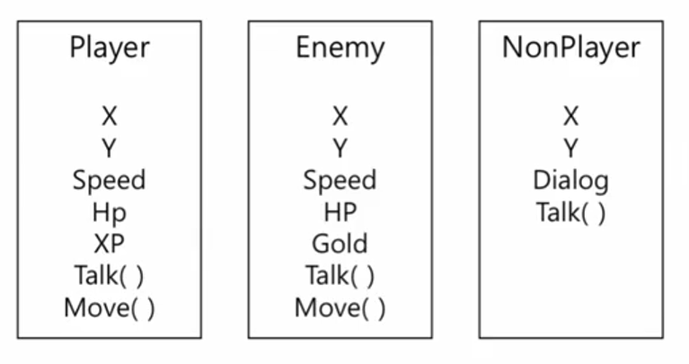
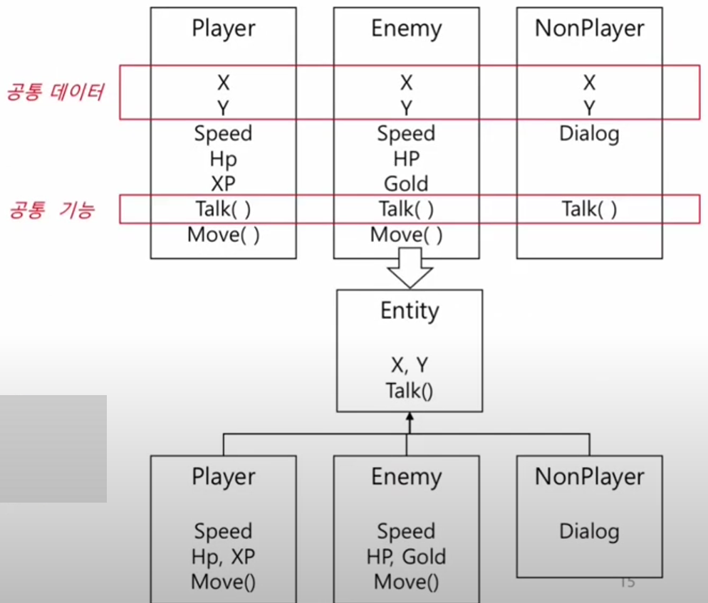
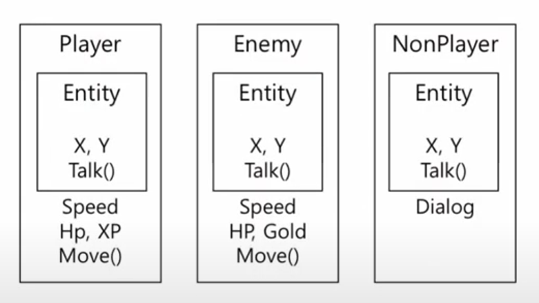
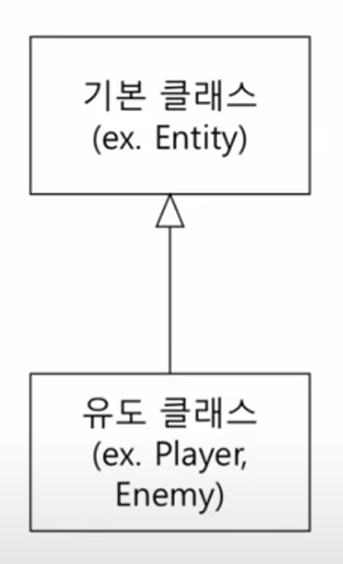
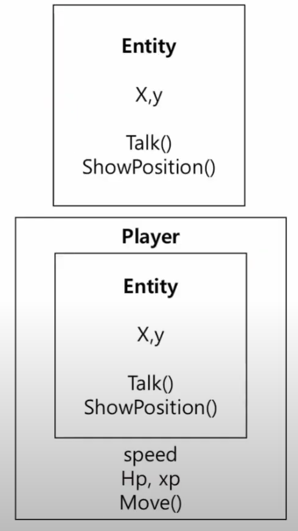
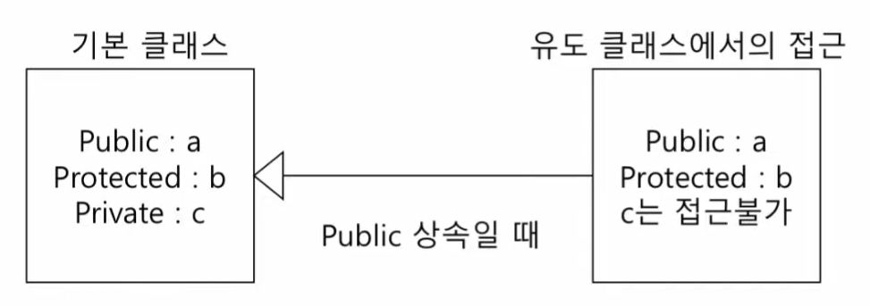
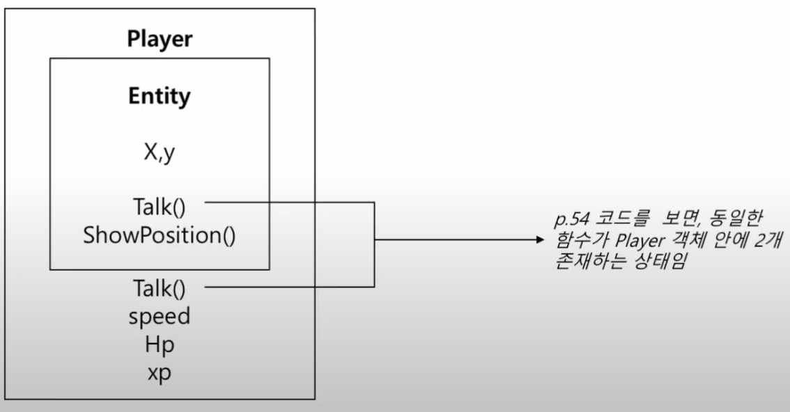

__목차__
- [Inheritance](#inheritance)
  - [상속이 필요한 이유](#상속이-필요한-이유)
  - [Definition of Inheritance](#definition-of-inheritance)
    - [Player 예시 설계](#player-예시-설계)
  - [Deriving classes from existing class](#deriving-classes-from-existing-class)
    - [C++ 상속 문법](#c-상속-문법)
  - [Protected Member](#protected-member)
  - [__Constructors and Destructors__](#constructors-and-destructors)
    - [Constructors](#constructors)
    - [Destructors](#destructors)
    - [생성자와 소멸자의 상속](#생성자와-소멸자의-상속)
  - [Passing Arguments to Base Class Constructor](#passing-arguments-to-base-class-constructor)
  - [Copy Constructor](#copy-constructor)
    - [멤버 변수가 value일 때](#멤버-변수가-value일-때)
    - [멤버 변수가 pointer일 때](#멤버-변수가-pointer일-때)
  - [Using Member Function of Base Class](#using-member-function-of-base-class)
    - [정적 바인딩](#정적-바인딩)
    - ["ls-A" 관계](#ls-a-관계)
  - [(Summary) Inheritance](#summary-inheritance)

# Inheritance
## 상속이 필요한 이유
+ Player 클래스
    ```cpp
    using namespace std;

    class Player
    {
    private:
        int x, y;
        int speed;
    public:
        Player(int x, int y, int speed)
            : x{ x }, y{ y }, speed{ speed }
        {}
        void Move(int dx, int dy)
        {
            x += dx * speed;
            y += dy * speed;
        }
        void ShowPosition()
        {
            cout << "x : " << x << endl;
            cout << "y : " << y << endl;
            cout << "speed : " << speed << endl;
            cout << "" << endl;
        }
    };
    ```

+ Player 관리를 위한 클래스
  + 컨트롤/매니저 클래스라 부름
    ```cpp
    class PlayerHandler
    {
    private:
        Player* playerList[50];
        int playerNum;
    public:
        PlayerHandler() : playerNum{ 0 } {}
        void AddPlayer(Player* p)
        {
            playerList[playerNum++] = p;
        }
        void ShowAllPlayerPosition() const
        {
            for (int i = 0; i < playerNum; i++)
            {
                playerList[i]->ShowPosition();
            }
        }
        ~PlayerHandler()
        {
            for (int i = 0; i < playerNum; i++)
            {
                delete playerList[i];
            }
        }
    };
    ```

+ main 함수
    ```cpp
    int main()
    {
        PlayerHandler playerHandler;
        playerHandler.AddPlayer(new Player(1, 1, 1));
        playerHandler.AddPlayer(new Player(5, 5, 1));
        playerHandler.AddPlayer(new Player(2, 3, 1));
        playerHandler.ShowAllPlayerPosition();
    }
    ```

+ 상속이 필요한 이유, 시나리오
  + Player 이외에 Enemy와 NPC가 추가된다면?
  + Enemy와 NPC의 이동 방식이 다르다면?
    + Enemy: dx * speed * 1.5
    + NPC: 이동 불가능
  + Enemy 및 NPC클래스를 추가 구현했을 때, 컨트롤 클래스를 얼마나 수정해야 하는가?
+ 상속이 필요한 이유
  + 멤버 변수 추가 필요
  + 클래스별 정보 추가기능 필요
  + 클래스별 위치 정보 출력 반복문 필요
  + 클래스별 해제 필요

__상속과 다형성을 활용해 적은 수정으로 기능 추가 가능하도록 설계 가능!__

## Definition of Inheritance
+ 상속
  + 기존 클래스를 기반으로 새로운 클래스를 생성하는 방법
  + 새로운 클래스는 __기존 클래스의 데이터와 행동(함수)를 포함__
  + 기존 클래스를 __재사용__ 가능하게 함
  + 클래스들 간의 공통 속성에 집중하는 설계 방법
  + 기존 클래스의 행동(함수)를 수정하여, 새로운 클래스의 행동을 새로 정의 가능
    + 기존 클래스의 행동을 수정할 필요는 없음

+ 관련된 클래스의 예시
  + Player, Enemy, NPC, Boss, Hero, Super Hero, etc.
  + Account, Saving Account, Checking  Account, Trust Account, etc.
  + Shape, Line, Oval, Circle, Square, etc.
  + Person, Employee, Student, Faculty, Staff, Administrator, etc.

### Player 예시 설계
+ Player
  + x, y, speed, hp, xp, Talk(), Move()
+ Enemy
  + x, y, speed, hp, gold, Talk(), Move()
+ NonPlayer
  + x, y, dialog, Talk()
+ 행동(함수)은 클래스마다 다를 수 있음

<p align="center">
    </img>
</p>

+ 상속을 사용하지 않은 예 (코드의 중복 작성)
    ```cpp
    class Player {
        // x, y, speed, hp, xp, Talk(), Move()
    };

    class Enemy {
        // x, y, speed, hp, gold, Talk(), Move()
    };

    class NonPlayer {
        // x, y, dialog, Talk()
    };
    ```
+ 상속을 사용한 예 (코드의 재사용)
    ```cpp
    // 공통 데이터와 기능을 모아놓은 클래스
    class Entitiy {
        // x, y, Talk()
    };

    class Player : public Entitiy{
        // speed, hp, xp ,Move()
    };

    class Enemy : public Entitiy{
        // speed, hp, gold ,Move()
    };

    class NonPlayer : public Entitiy{
        // dialog
    };
    ```
<p align="center">
    </img>
</p>

+ __Player 객체는 두 가지 타입을 모두 가진 상태가 됨__
  + __i.e. Player 객체는 Player 타입이기도 하지만 Entitiy 타입이기도 함!__
<p align="center">
    </img>
</p>

+ 기본 클래스 (base class / parrent class / super class)
  + 상속의 대상이 되는 클래스
+ 유도 클래스(derived class / child class / sub class)
  + 기본 클래스로부터 생성되는 클래스
  + 데이터와 행동을 기본 클래스로부터 상속함
<p align="center">
    </img>
</p>

## Deriving classes from existing class
### C++ 상속 문법
```cpp
class Base{
    // base class members...
};

class Derived : public Base{
    // derived class members...
};
```

+ Public 상속
  + 가장 흔히 사용되는 상속 방식
  + "is-a" 관계의 정의와 가장 일치하는 상속 방식
+ Player Example
<p align="center">
    </img>
</p>

+ 추가 정보

public = 어디서든 접근이 가능.

protected = 상속관계일 때 접근이 가능

private = 해당 클래스에서만 접근이 가능

```cpp
class Entity
{
protected: // Player 클래스 내에서는 사용하기 위함, But! Player 객체에서는 접근 x
	int x;
	int y;
public:
	Entity(int x, int y)
		: x{ x }, y{ y }{}
	void ShowPosition()
	{
		cout << "[" << x << ", " << y << "]" << endl;
	}
	void Talk()
	{
		cout << "Hello." << endl;
	}
};

class Player : public Entity
{
private:
	int hp;
	int xp;
	int speed;
public:
	Player(int x, int y, int speed)
		: Entity{ x,y }, speed{ speed }{}
	void Move(int dx, int dy)
	{
		x += dx;
		y += dy;
	}
};

int main()
{
	Entity e{ 1,1 };
	e.ShowPosition();
	e.Talk();

    // Player도 Entity의 기능도 쓸 수 있음
	Player p{ 5,5, 10 };
	p.ShowPosition();
	p.Talk(); 
}
```

## Protected Member
+ 기본 클래스에서 접근 가능
+ 유도 클래스에서 접근 가능
+ 기본 또는 유도 클래스의 객체로부터는 접근 불가능!
  + Private을 생각해보자. 클래스에서는 접근 가능하고, 객체로부터는 접근이 불가능하였음
  + __Protected는 "상속이 이루어지는 private"라고 생각하면 편함__
  + Private은 유도 클래스에서 접근이 불가능 -> private은 상속과 관계없이 무조건 (자신)클래스 내부에서만 접근 가능함

```cpp
class Base
{
protected:
    // protected members
};
```

+ protected 멤버 변수

<p align="center">
    </img>
</p>

```cpp
class Base
{
public:
    int a;
protected:
    int b;
private:
    int c;
};

class derived : public Base
{};

int main()
{
    derived d;
    d.a = 10;
    d.b = 10; // ERROR! -> protected: (유도, 기본) 클래스 객체에서 접근 불가능, (유도, 기본) 클래스에서는 접근 가능
    d.c = 10; // ERROR! -> private: 객체에서 접근 불가능, 유도 클래스에서도 접근 불가능
}
```

## __Constructors and Destructors__
### Constructors
+ 유도 클래스는 기본 클래스의 멤버를 포함하므로, 유도 클래스가 초기화 되기 __이전에__ 기본 클래스에서 상속된 부분이 반드시 초기화 되어야 함
+ __유도 클래스 객체가 생성될 때__
  + __먼저 기본 클래스의 생성자가 호출되고,__
  + __그 이후 유도 클래스의 생성자가 호출됨__

```cpp
class Base
{
public:
	Base()
	{
		cout << "Base Constructor" << endl; // 1. 기본 클래스의 생성자 호출
	}
};

class Derived : public Base
{
public:
	Derived()
	{
		cout << "Derived Constructor" << endl; // 2. 유도 클래스의 생성자 호출
	}
};

int main()
{
	Derived d; // 유도 클래스 객체 생성
}
```

### Destructors
+ 소멸자는 생성자와 **반대 순서**로 호출됨
+ 즉, 유도 클래스가 소멸될 때
  + 먼저 유도 클래스의 소멸자가 호출되고,
  + 그 이후 기본 클래스의 소멸자가 호출됨

```cpp
class Base
{
public:
	Base()
	{
		cout << "Base Constructor" << endl;
	}
    ~Base()
	{
		cout << "Base Destructor" << endl; // 2. 기본 클래스의 소멸자 호출
	}
};

class Derived : public Base
{
public:
	Derived()
	{
		cout << "Derived Constructor" << endl; 
	}
    ~Derived()
	{
		cout << "Derived Destructor" << endl; // 1. 유도 클래스의 소멸자 호출
	}
};

int main()
{
	Derived d; // 유도 클래스 객체 생성
}
```

### 생성자와 소멸자의 상속
+ 유도 클래스는 기본 클래스의 생성자, 소멸자 및 오버로딩된 대입 연산자를 상속하지 않음
+ 대신, 기본 클래스의 생성자, 소멸자 및 오버로딩된 대입 연산자를 유도 클래스로부터 호출이 가능함
  + 다음 Chapter에서 설명

```cpp
class Base
{
private:
	int value;

public:
	Base()
		: value{ 0 }
	{
		cout << "Base no-arg Constructor" << endl;
	}
	Base(int val)
		: value{ val }
	{
		cout << "Base One argument Constructor" << endl;
	}
	~Base()
	{
		cout << "Base Destructor" << endl; // 2. 기본 클래스의 소멸자 호출
	}
};

class Derived : public Base
{
private:
	int doubledValue;

public:
	Derived()
		: doubledValue{ 0 }
	{
		cout << "Derived no-arg Constructor" << endl;
	}
	Derived(int val)
		: doubledValue{ 2*val }
	{
		cout << "Derived One argument Constructor" << endl;
	}
	~Derived()
	{
		cout << "Derived Destructor" << endl; // 1. 유도 클래스의 소멸자 호출
	}
};

int main()
{
	Base b1; // value: 0
	Base b2{ 100 }; // value: 100

	Derived d1;	// value: 0, doubled_value: 0
	Derived d2{ 1000 }; // value: 0!!, doubled_value: 2000

    return 0;
}
```

## Passing Arguments to Base Class Constructor
+ 기본 클래스의 어떤 생성자를 호출할지 결정해 줄 수 있어야 함
+ __유도 클래스의 생성자에, 초기화 리스트를 활용해 사용자가 원하는 기본 클래스의 생성자 호출 가능__

```cpp
class Base{
public:
    Base();
    Base(int); // 호출
    ...
};

Derived::Derived(int x)
    : Base{ x }, {...} // Base{ x } 이므로 기본 클래스의 인자가 하나인 생성자가 호출됨.
{
    // derived constructor code
}
```


```cpp
class Base
{
protected:
    int value;
public:
    Base()
        : value{ 0 }
    {
        cout << "Base no-arg Constructor" << endl;
    }
    Base(int val)
        : value{ val }
    {
        cout << "Base One argument Constructor" << endl;
    }
};

class Derived : public Base
{
private:
    int doubledValue;
public:
    Derived()
        : Base{}, doubledValue{ 0 }
    {
        cout << "Derived no-arg Constructor" << endl;
    }
    Derived(int val)
        : Base{ val }, doubledValue{ 2 * val } // Base{ val } -> Base(int val) 생성자 호출
        // val까지 넘겨줄 수 있음
    {
        cout << "Derived One argument Constructor" << endl;
    }
};

int main()
{
    Base b1; // value: 0
    Base b2{ 100 }; // value: 100
    Derived d1; // value: 0, doubled_value: 0
    Derived d2{ 1000 }; // value: 1000, doubled_value: 2000

    return 0;
}
```

## Copy Constructor
+ 기본 클래스로부터 상속되지 않음
+ (상속 전과 마찬가지로,) 컴파일러가 자동생성하지만, 필요한 경우 직접 구현 해야함
+ 기본 클래스에서 구현한 복사 생성자 호출 가능
+ Slice 과정을 거침
+ 이동 생성자도 동일하게 동작
```cpp
Derived::Derived(const Derived& other)
    : Base{ other }, {Derived Initialization list}
    {
        // code
    }
```

### 멤버 변수가 value일 때
```cpp
class Base
{
protected:
    int value;
public:
    Base()
        : value{ 0 }
    {
        cout << "Base no-arg Constructor" << endl;
    }
    Base(int val)
        : value{ val }
    {
        cout << "Base One argument Constructor" << endl;
    }
    Base(const Base& other) // Base 클래스의 복사 생성자
        : value{ other.value }
    {}
};

class Derived : public Base
{
private:
    int doubledValue;
public:
    Derived()
        : Base{}, doubledValue{ 0 }
    {
        cout << "Derived no-arg Constructor" << endl;
    }
    Derived(int val)
        : Base{ val }, doubledValue{ 2 * val } // Base{ val } -> Base(int val) 생성자 호출
        // val까지 넘겨줄 수 있음
    {
        cout << "Derived One argument Constructor" << endl;
    }
    Derived(const Derived& other) // 유도 클래스의 복사 생성자
        : Base{ other }, doubledValue{ other.doubledValue } {} // Base{ other } -> Base 클래스의 복사생성자 / 유도 클래스는 기본 클래스이기도 하기 때문
};

int main()
{
    Derived d1{ 10 }; // value: 10, doubledValue: 20
    Derived d2{ d1 }; // value: 10, doubledValue: 20

    // if. Base{ other }을 해주지 않으면 value: 0, doubledValue: 20
    return 0;
}
```

### 멤버 변수가 pointer일 때
+ Deep Copy
```cpp
class Base {
protected:
    int* value; // pointer 변수

public:
    Base(int val) : value(new int(val)) {
        cout << "Base One argument Constructor" << endl;
    }

    Base(const Base& other) : value(new int(*other.value)) {
        cout << "Base Copy Constructor" << endl;
    }

    virtual ~Base() {
        delete value;
    }

    // 추가 메소드...
};

class Derived : public Base {
private:
    int* doubledValue;

public:
    Derived(int val) : Base(val), doubledValue(new int(2 * val)) {
        cout << "Derived One argument Constructor" << endl;
    }

    Derived(const Derived& other) : Base(other), doubledValue(new int(*other.doubledValue)) {
        cout << "Derived Copy Constructor" << endl;
    }

    ~Derived() {
        delete doubledValue;
    }

    // 추가 메소드...
};

int main() {
    Derived d1(10);
    Derived d2 = d1; // 복사 생성자 호출
    return 0;
}
```

+ 복사생성자의 구현 가이드
  + 유도 클래스에서 사용자가 복사 생성자를 구현하지 않은 경우,
    + 컴파일러가 자동으로 생성하며, 기본 클래스에 있는 인자를 받지 않는 생성자를 호출
  + 유도 클래스에서 사용자가 복사 생성자를 구현한 경우,
    + 명시하지 않으면 기본 클래스의 인자를 받지 않는 생성자를 호출
    + 기본 클래스를 위한 복사/이동 생성자를 명시해 줄 수 있음
  + 따라서, 포인터형 멤버 변수를 가지고 있는 경우, 기본 클래스의 복사/이동 생성자를 호출하는 방법에 대해 반드시 숙지해 두어야 함
    + 유도 클래스 멤버 변수에 대한 깊은 복사 고려

## Using Member Function of Base Class
+ 유도 클래스는 기본 클래스의 멤버 함수를 직접 호출 가능
  + Public / protected인 멤버 함수의 경우에 한함
+ 유도 클래스는 기본 클래스의 멤버 함수를 __오버라이드 또는 재정의__ 가능
+ 다형성의 구현을 위해 중요한 기능

### 정적 바인딩
+ 밑의 그림대로라면, 유도 클래스와 기본 클래스에 같은 이름과 인자를 갖는 함수가 2개 존재
+ 어떤 기준으로 호출한 함수를 결정할까? -> 타입을 기준 호출!

<p align="center">
    </img>
</p>

```cpp
class Entity
{
protected:
	int x;
	int y;
public:
	Entity(int x, int y)
		: x{ x }, y{ y }{}
	void ShowPosition()
	{
		cout << "[" << x << ", " << y << "]" << endl;
	}
	void Talk()
	{
		cout << "Hello." << endl;
	}
};

class Player : public Entity
{
private:
	int hp;
	int xp;
	int speed;
public:
	Player(int x, int y, int speed)
		: Entity{ x,y }, speed{ speed }{}

	void Talk()
	{
		cout << "Hello, I'm Player" << endl;
	}
};

int main()
{
	Player p{ 5,5, 10 };
	p.Talk(); // Hello, I'm Player

	Entity e{ 1,1 };
	e.Talk(); // Hello.

	e = p;
	e.Talk(); // Hello. Type은 변하지 않음
}
```

+ 정적 바인딩과 그 한계
  + 정적 바인딩은 컴파일 시 어떤 함수가 호출될지를 결정하는 방식
  + C++의 기본은 정적 바인딩
    + 가장 아래의 경우, 동적 바인딩을 사용하여 기능의 확장 가능(다음 강의)
```cpp
Entity e{ 1,1 };
e.Talk(); // Entity::Talk() call

Player p{ 1,1,2 };
p.Talk(); // Player::Talk() call

Entity* ePtr = new Player{ 1,1,2 };
ePtr->Talk(); // Entity::Talk() call
```

### "ls-A" 관계
+ __기본 클래스 객체를 사용하는 곳에는 항상 유도 클래스 객체를 사용 가능__
  + __유도 클래스에 기본 클래스의 멤버가 모두 포함되기 때문 (superset)__
  + __Player 객체는 두 가지 타입을 모두 가진 상태가 됨!__
```cpp
int main()
{
	Player p{ 0,0,1 };

	// Entity 대신, p를 인자로 넣어도 오류 없음
	TalkSomething(p);
	ShowSomething(p);
}
```
포인터와 참조자의 경우
```cpp
Entity p = Player{ 1,1,1 };
Player p2 = Player{ 1,1,10 };

// Entity 타입이, Player 타입을 가리켜도 오류 없음
Entity* ePtr = new Player{ 1,1,1 };
Entity& eRef = p2;
pRef.ShowPosition();

// Impossible
Player* pPtr = new Entity{ 1,1,1 };
Player& pRef = new Entity{ 1,1,1 }; // 반대의 경우 ERROR
```

+ 명확한 호출 방법
    ```cpp
    void Move(int dx, int dy)
    {
        x += dx; y += dy;
        Entity::Talk(); // Entity 클래스의 Talk() 호출방법
        Player::Talk(); // Player 클래스의 Talk() 호출방법
    }
    ```

## (Summary) Inheritance
+ 상속의 정의: 기본 클래스를 기반으로 새 클래스를 만드는 기능
+ 유도 클래스: 그렇게 만들어진 클래스를 유도 클래스라 하며, 기본 클래스의 모든 것이 포함되어 있음
+ protected 멤버: 상속에서 public은 그대로, private은 여전히 private이므로, 정보를 숨기되 상속 계층의 하위로 데이터를 상속하고 싶을 때는 protected를 사용
+ 상속에서의 생성자와 소멸자: 기본 생성-유도 생성 / 유도 소멸-기본 소멸 순서
+ 기본 클래스 생성자와의 관계: 유도 클래스 (복사)생성시에, 기본 클래스를 어떻게 (복사)생성할지를 초기화 리스트를 사용해 명시해 주어야 함
+ 상속과 멤버 함수: 유도 클래스에서, 기본 클래스의 함수 재정의 가능. 호출은 정적 바인딩 기준으로 이루어짐. "ls-A" 관계 철학에 따라 기본 클래스가 사용되는 곳에는 유도 클래스 사용 가능
