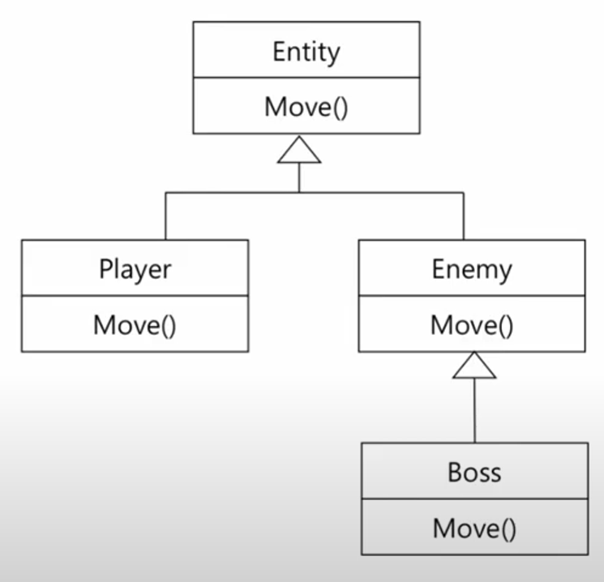
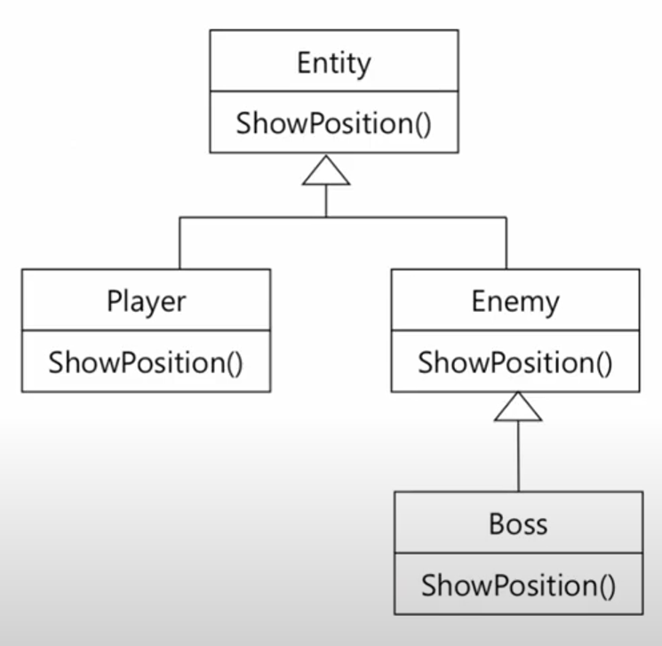
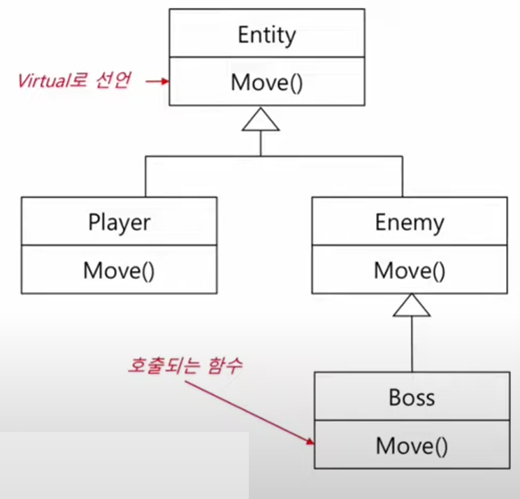
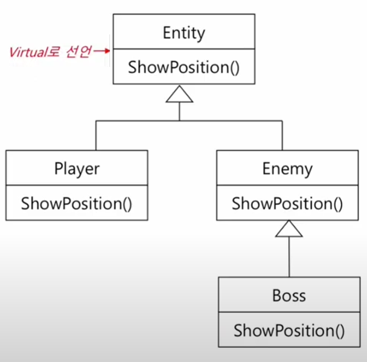

__목차__
- [Polymorphism (다형성)](#polymorphism-다형성)
	- [다형성과 동적 바인딩](#다형성과-동적-바인딩)
		- [정적 바인딩 예시](#정적-바인딩-예시)
		- [동적 바인딩 예시](#동적-바인딩-예시)
	- [Virtual Function (가상 함수)](#virtual-function-가상-함수)
		- [가상함수의 선언, 기본 클래스에서 할 일](#가상함수의-선언-기본-클래스에서-할-일)
	- [Virtual Destructor (가상 소멸자)](#virtual-destructor-가상-소멸자)
	- [Base Class Pointer](#base-class-pointer)
	- [__Override Specifier (오버라이드 지정자)__](#override-specifier-오버라이드-지정자)
		- [override 지정자가 필요한 이유](#override-지정자가-필요한-이유)
		- [override Specifier](#override-specifier)
		- [final Specifier](#final-specifier)
	- [Pure Virtual Functions and Abstract Classes](#pure-virtual-functions-and-abstract-classes)
		- [순수 가상 함수와 추상 클래스 예시](#순수-가상-함수와-추상-클래스-예시)
	- [Abstract Classes and Interface](#abstract-classes-and-interface)
	- [(Summary) Polymorphism](#summary-polymorphism)
		- [Example using pointer](#example-using-pointer)

# Polymorphism (다형성)
+ 다형성
  + 정적 바인딩 (Compile-time) (함수 오버로딩, 연산자 오버로딩)
  + 동적 바인딩 (Run-time)
+ 런타임 다형성
  + 런타임에서 같은 함수에 대해 다른 의미를 부여 <- __함수의 오버라이딩__
+ 추상화된 프로그래밍을 가능하게 함
+ C++에서 런타임 다형성(=동적 바인딩)을 구현하기 위해 아래와 같은 조건이 필요
  + __상속__
  + __기본 클래스 포인터 or 참조자__
  + __가상 함수__
  
## 다형성과 동적 바인딩
### 정적 바인딩 예시

+ 예시 1
```cpp
Entity entity{ 0,0 };
entity.Move( 1, 1 ); // Entity::Move()

Player player{ 0,0 };
player.Move( 1, 1 ); // Player::Move()

Enemy enemy{ 0,0 };
enemy.Move( 1, 1 ); // Enemy::Move()

Boss boss{ 0,0 };
boss.Move( 1, 1 ); // Boss::Move()

Entity* ePtr = new Boss{ 0,0,2 };
ePtr->Move( 1, 1 ); // Entity::Move() !!
```

<p align="center">
    </img>
</p>

+ 예시 2
```cpp
void DisplayPosition(const Entity& e) // e에 Entity, Player, Enemy객체 모두 넘겨줄 수 있음
{
    e.ShowPosition();
    // Entity::ShowPosition() called
}

Entity entity{ 0,0 };
DisplayPosition(entity); // Entity::ShowPosition()

Player player{ 0,0,2 };
DisplayPosition(palyer); // Entity::ShowPosition()

Enemy enemy{ 0,0,2 };
DisplayPosition(enemy); // Entity::ShowPosition()
```

<p align="center">
    </img>
</p>

### 동적 바인딩 예시
+ 예시 1

컴파일러는 런타임에 ePtr의 실제 타입을 확인하고, 해당 클래스의 멤버 함수를 호출
```cpp
Entity entity{ 0,0 };
entity.Move( 1, 1 ); // Entity::Move()

Player player{ 0,0 };
player.Move( 1, 1 ); // Player::Move()

Enemy enemy{ 0,0 };
enemy.Move( 1, 1 ); // Enemy::Move()

Boss boss{ 0,0 };
boss.Move( 1, 1 ); // Boss::Move()

Entity* ePtr = new Boss{ 0,0,2 };
ePtr->Move( 1, 1 ); // Boss::Move() !!
```

<p align="center">
    </img>
</p>

+ 예시 2

컴파일러는 런타임에 e의 타입을 확인하고, 해당 클래스의 멤버 함수를 호출
```cpp
void DisplayPosition(const Entity& e) // e에 Entity, Player, Enemy객체 모두 넘겨줄 수 있음
{
    e.ShowPosition();
    // Entity::ShowPosition() called
}

Entity entity{ 0,0 };
DisplayPosition(entity); // Entity::ShowPosition()

Player player{ 0,0,2 };
DisplayPosition(palyer); // Player::ShowPosition()

Enemy enemy{ 0,0,2 };
DisplayPosition(enemy); // Enemy::ShowPosition()
```
<p align="center">
    </img>
</p>

## Virtual Function (가상 함수)
+ Move()와 같이, 유도 클래스에서 기본 클래스의 함수를 재정의 또는 오버라이드해 사용할 수 있음
+ 오버라이드된 함수는 동적 바인딩을 통해 12, 13 페이지의 예제와 같이 활용 가능
+ 오버라이드될 수 있는 함수를 가상함수라 함
  + 예제에서처럼, 기본 클래스의 함수(Entity::Move)가 가상함수로 선언 후, 유도 클래스에서 해당 함수를 오버라이드해서 구현하면 동적 바인딩됨

+ C++에서 동적 바인딩의 구현을 위해 아래와 같은 조건이 필요
  + __상속__
  + __기본 클래스 포인터 또는 참조자__
  + __가상 함수__

### 가상함수의 선언, 기본 클래스에서 할 일
+ 오버라이드 할 함수를 기본 클래스에서 virtual로 선언해 주어야 함
+ 상속 계층구조에 있는 모든 함수는 가상 함수가 됨
+ 오버라이드할 함수를 유도 클래스에서 구현
+ __함수 원형(prototype)과 반환형이 기본 클래스의 가상함수와 일치해야 함!__
+ 유도 클래스의 함수에서는 virtual 키워드를 넣지 않아도 되지만, 혼동을 피하기 위해 명시해 주는 것을 권고
+ 유도 클래스에서 함수를 오버라이드하지 않으면, 기존과 같이 기본 클래스의 함수가 상속됨

```cpp
class Entity
{
public:
    virtual void Move(int dx, int dy);
    ...
};

class Player : public Entity{
public:
    virtual void Move(int dx, int dy); // 함수 원형(prototype)과 반환형이 기본 클래스의 가상함수와 일치해야 함
    //혼동을 피하기 위해 명시해 주는 것을 권고
    ...
};
```

Example
```cpp
class Entity
{
protected:
	int x;
	int y;
public:
	Entity(int x, int y)
		: x{ x }, y{ y }{}
	virtual	void Move(int dx, int dy) // 가상함수
	{
		x += dx;
		y += dy;
	}
	void PrintPosition()
	{
		cout << x << ", " << y << endl;
	}
};

class Player : public Entity
{
private:
	int hp;
	int xp;
public:
	Player(int x, int y, int hp, int xp)
		:Entity{ x,y }, hp{ hp }, xp{ xp }{}

	virtual void Move(int dx, int dy)
	{
		x += dx * 2;
		y += dy * 2;
	}
};

int main()
{
	Player p{ 1,1,10,10 };
	p.PrintPosition();

	p.Move(2, 1);
	p.PrintPosition();
}
```

## Virtual Destructor (가상 소멸자)
+ 다형성 객체를 소멸할 때의 고려사항
  + 포인터를 사용한 뒤 해제할 때, 소멸자가 정적 바인딩되어 있다면 기본 클래스의 소멸자가 호출됨

```cpp
class Entity
{
protected:
	int x;
	int y;
public:
	Entity(int x, int y)
		: x{ x }, y{ y }{}
	~Entity()
	{
		cout << "Entity Destructor Called" << endl;
	}
};

class Player : public Entity
{
private:
	int hp;
	int xp;
public:
	Player(int x, int y, int hp, int xp)
		:Entity{ x,y }, hp{ hp }, xp{ xp }{}
	~Player()
	{
		cout << "Player Destructor Called" << endl;
	}
};

int main()
{
	Entity* ptr = new Player{ 1,1,10,10 };

	// use ptr

	delete ptr; // ~Entity() 호출, ~Player() 호출 x
}
```

ptr을 해제하면 소멸자가 호출됨

Ptr의 타입은 Entity* 이므로 Entity의 소멸자만 호출!

만일 Player의 멤버에 동적 할당한 포인터가 있었다면 어떤 문제가 발생할까?

+ 유도 객체를 올바른 순서로, 올바른 소멸자를 사용해 소멸시키는 방법이 필요
+ 해결 방법 ? -> 가상 소멸자
  + __클래스가 가상 함수를 가지면, 항상 가상 소멸자를 함께 정의해야 함__
  + 마찬가지로, 기본 클래스의 소멸자가 가상 소멸자면, 유도 클래스의 소멸자도 가상 소멸자

~Entity() 호출, ~Player() 호출
```cpp
class Entity
{
public:
    virtual ~Entity();
    ...
};
class Player
{
public:
    virtual ~Player();
    ...
};
```

## Base Class Pointer
+ 아래와 같이 배열을 구성하여 활용 가능!
```cpp
Entity* p1 = new Entity{ 0,0 };
Entity* p2 = new Player{ 0,0,2,2 };
Entity* p3 = new Enemy{ 0,0,2,2 };
Entity* p4 = new Boss{ 0,0,2,2 };

Entity* array[] = { p1,p2,p3,p4 };

for (int i=0; i<4; i++)
    array[i]->Move(1,1); // 각각의 타입에 맞게 Move 실행
```

+ 참조자도 똑같이 활용 가능
```cpp
int main()
{
	Player p{ 3,3,20,20 };
	Entity& ref = p;
	ref.Move(2, 2); // Player::Move()
	ref.PrintPosition();
}
```

+ 기본 클래스의 참조자를 활용한 다형성
```cpp
void MoveX(Entity& e, int dx) // 기본 클래스의 참조자이기 때문에 동적 바인딩 됨
{
    e.Move(dx, 0);
}

Entity e{ 0,0 };
MoveX(e,1); // Entity::Move()

Player p{ 0,0,2,2 };
MoveX(p,1); // Player::Move()
```

## __Override Specifier (오버라이드 지정자)__
+ (복습) 기본 클래스의 가상 함수는 오버라이드 가능하다.
+ (복습) 오버라이드를 위해서는 함수의 원형과 반환형이 동일해야 한다.
  + 만일 다르다면, 오버라이드가 아닌 "재정의"가 되어버림(서로 다른 별개의 함수로 인식)
  + 재정의 정적 바인딩
+ C++ 11부터 override 지정자 기능을 제공하여 오버라이딩시 실수를 방지하고, 코드의 가독성을 상승 가능
  + 어떤 함수가 오버라이딩된 함수인지 정의만 보고도 파악 가능
  
### override 지정자가 필요한 이유

유도 클래스에 실수로 const를 빼먹었다! 오버라이드가 아닌 재정의된 함수가 되었음

사용자의 의도(오버라이드? 재정의?)를 알 수 없기 때문에 컴파일 에러 발생하지 않음
```cpp
class Base
{
public:
	virtual void say_hello() const
	{
		cout << "Hello, I'm Base" << endl;
	}
	virtual ~Base() {}
};

class Derived : public Base
{
public:
	virtual void say_hello() // const 빼먹었기 때문에 다른 함수가 됨
	{
		cout << "Hello, I'm Deruved" << endl;
	}
	virtual ~Derived() {}
};
```

+ 재정의되었기 때문에, 아래와 같이 의도하지 않게 동작함
```cpp
Base* p1 = new Base();
p1->say_hello(); // "Hello, I'm Base"

Base* p2 = new Derived();
p2->say_hello(); // "Hello, I'm Base"
```

### override Specifier

사용자의 의도(오버라이드)를 파악했기 때문에, 함수 원형이 일치하지 않는다는 컴파일 에러 발생

코드의 규모가 커질 경우 정확한 오류 원인 파악이 어려움. 파악하기 위해 override 지정자 사용
```cpp
class Base
{
public:
	virtual void say_hello() const
	{
		cout << "Hello, I'm Base" << endl;
	}
	virtual ~Base() {}
};

class Derived : public Base
{
public:
	virtual void say_hello() override // override 지정자
	{
		cout << "Hello, I'm Deruved" << endl;
	}
	virtual ~Derived() {}
};
```

### final Specifier
+ C++ 11부터 final 지정자 기능을 제공
+ 클래스의 final
  + 클래스를 더 이상 상속하지 못하도록 함

```cpp
class Base final // final 지정자
{};

class Derived : public Base
{}; // ERROR
```

+ 멤버 함수의 final
  + 유도 클래스에서 가상 함수를 오버라이드 하지 못하도록 함

```cpp
class A
{
public:
	virtual void do_something();
};

class B : public A
{
public:
	virtual void do_something() override final; // B에서의 do_something override는 OK
};

class C : public B
{
public:
	virtual void do_something(); // ERROR! B에서의 do_something을 final로 명시하였ㅇ으므로, C에서는 오버라이드 불가!
};
```

## Pure Virtual Functions and Abstract Classes
+ 추상 클래스 (Abstract Class)
  + 객체를 생성할 수 없는 클래스
  + 상속 계층구조에서 기본 클래스로 사용됨
  + 아주 일반적이어서 객체를 생성하기엔 맞지 않는..
    + Entity(무슨 Entity?), Account(어떤 통장?)
+ 구상 클래스 (Concrete Class)
  + 객체를 생성할 수 있는 클래스
  + 모든 멤버 함수가 구현되어 있어야 함
    + 지금까지 예시로 든 모든 클래스는 구상 클래스

+ 추상 클래스는 하나 이상의 "순수 가상 함수"를 갖는다.
+ 즉, __"순수 가상 함수"가 있는 클래스는 추상 클래스이다.__
  + 멤버 함수의 선언 뒤에 " = 0 "을 붙이면 순수 가상 함수가 됨

```cpp
virtual void function() = 0;
```
Example
```cpp
class Entity // 순수 가상 함수를 가지고 있으므로 이 클래스는 추상 클래스가 됨
{
protected:
	int x;
	int y;
public:
	Entity(int x, int y)
		: x{ x }, y{ y }{}
	virtual ~Entity()
	{
		cout << "Entity Destructor Called" << endl;
	}

	virtual	void Move(int dx, int dy) = 0; // 순수 가상 함수
	
	void PrintPosition()
	{
		cout << x << ", " << y << endl;
	}
};

class Player : public Entity
{
private:
	int hp;
	int xp;
public:
	Player(int x, int y, int hp, int xp)
		:Entity{ x,y }, hp{ hp }, xp{ xp }{}
	virtual ~Player()
	{
		cout << "Player Destructor Called" << endl;
	}
	virtual void Move(int dx, int dy) override
	{
		x += dx * 2;
		y += dy * 2;
	}
};

int main()
{
	Entity e{ 1,1 }; // Entity 객체 만들 수 없음
}
```

+ 순수 가상 함수"가 있는 클래스는 추상 클래스이다.
  + 유도 클래스들은 반드시 기본 클래스의 순수 가상함수를 오버라이드 해야 함
    + 오버라이드 하지 않는 경우, 유도 클래스도 추상 클래스로 간주됨
    + __즉, 유도 클래스에서 특정 함수 구현을 "강제"하는 의미를 가짐__
+ 사용 목적
  + 기본 클래스에서의 구현이 적절하지 않은 경우
  + 유도 클래스에서는 반드시 구현해야 함을 명시하기 위해

+ 모든 Entity는 x,y 좌표를 가지고 있고 이동이 가능함. 그러나 실제로 게임 내에서 표현되는 객체가 되려면 어떤 로직으로 이동이 가능한지 구체적 기능이 필요함
  + 그래서 Player객체, Enemy객체가 이동이 가능하려면, Move()함수를 반드시 오버라이딩 해야 함을 강제하기 위해 Move()를 순수 가상 함수로 구현함

### 순수 가상 함수와 추상 클래스 예시
```cpp
class Shape // Abstract
{
private:
	// member variables
public:
	virtual void draw() = 0; // 순수 가상함수들이 있으니, 추상 클래스임
	virtual void rotate() = 0;
	virtual  ~Shape(); // 순수 가상 소멸자가 필요할 때도 있을까?
	...
};

class Circle : public Shape
{
private:
	// member variables
public:
	virtual void draw() override
	{
		// implementation for circle
	}
	virtual void rotate() override
	{
		// implementation for circle
	}
	// 가상 함수들을 모두 오버라이드 하여 구현하였으니 구상 클래스가 되었음
	virtual  ~Circle();
	...
};
```

+ 순수 가상 함수와 추상 클래스 예시
  + 추상 클래스는 객체를 생성할 수 없음

```cpp
Shape shape; // ERROR!
Shape* ptr = new Shape(); // ERROR!
```

+ __하지만 여전히 추상(기본) 클래스의 포인터/참조자를 사용해 오버라이딩된 함수를 동적 바인딩 할 수 있음__
```cpp
Shape *ptr = new Circle();
ptr->draw();
ptr->rotate();
```

## Abstract Classes and Interface
+ 추상 클래스를 사용한 인터페이스 클래스
  + 순수 가상함수"만"을 가진 추상 클래스를 인터페이스 클래스라 함
    + (C#, JAVA 언어는 따로 interface라는 키워드로 인터페이스 구현이 가능)
  + 클래스의 사용에 있어서 일반적인 기능(서비스)을 묶어놓은 클래스
  + 인터페이스 클래스를 기반으로 한 구상 클래스는 모든 기능(함수/서비스)를 구현해야 함
  + 인터페이스는 껍데기(?)다
  + 유도 클래스가 꼭 가져야 하는 기능들을 명시해 놓기 위해서 사용

+ 추상 클래스를 사용한 인터페이스 클래스 예시
```cpp
class Shape // Abstract, Interface
{ // 순수 가상 함수만을 가지고 있는 인터페이스
public:
	virtual void draw() = 0;
	virtual void rotate() = 0;
	virtual  ~Shape();
};

class Circle : public Shape // 인터 페이스 클래스를 상속한 구상 클래스
{
private:
	// member variables
public:
	virtual void draw() override
	{
		// implementation for circle
	}
	virtual void rotate() override
	{
		// implementation for circle
	}
	virtual  ~Circle();
	...
};
```

  + 통상적으로 인터페이스 클래스의 이름을 지을 땐 대문자 I를 앞에 붙임
	```cpp
	class IShape // Abstract, Interface
	{
	public:
		virtual void draw() = 0;
		virtual void rotate() = 0;
		virtual  ~IShape();
	};
	```


## (Summary) Polymorphism
+ 다형성과 동적 바인딩: 정적 바인딩은 컴파일시 타입을 기준으로 호출 함수를 결정하지만, 동적 바인딩은 런타임시 실제 메모리 타입을 기준으로 호출

+ 가상 함수: 컴파일러에게 동적 바인딩을 하라고 알려주기 위해서는 기본 클래스의 해당 함수를 virtual 키워드를 통해 가상함수로 만들어주어야 함. 이런 경우, 소멸자도 항상 가상 함수로 선언 필요

+ 기본 클래스의 포인터 / 참조자: 동적 바인딩을 위해서는 기본 클래스의 포인터/참조자로 유도 클래스를 가리키고 함수를 호출

+ override/final 지정자: override는 가상함수의 오버라이딩을 명시하여 실수 방지, final은 더 이상 상속/오버라이드 하지 못하도록 하는 키워드

+ 순수 가상 함수와 추상 클래스: 순수 가상함수가 있다면 추상 클래스이고, 이런 클래스는 객체를 생성할 수 없음. 유도 클래스에서 순수 가상함수를 오버라이딩 해야 객체 생성 가능

+ 추상 클래스와 인터페이스: 순수 가상함수"만"을 가진 추상 클래스를 인터페이스 클래스라고 하고, 유도 클래스가 꼭 가져야 하는 기능들을 명시해 놓기 위해서 사용함. 통상적으로 인터페이스 클래스의 이름을 지을 땐 대문자 I를 앞에 붙임

### Example using pointer
```cpp
class Entity
{
protected:
	int* x;
	int* y;
public:
	Entity(int x, int y)
		: x{ new int(x) }, y{ new int(y) } {}
	virtual ~Entity()
	{
		delete x;
		delete y;
		cout << "Entity Destructor Called" << endl;
	}

	virtual	void Move(int dx, int dy) = 0;
	
	void PrintPosition()
	{
		cout << *x << ", " << *y << endl;
	}
};

class Player : public Entity
{
private:
	int* hp;
	int* xp;
public:
	Player(int x, int y, int hp, int xp)
		:Entity{ x,y }, hp{ new int(hp) }, xp{ new int(xp) }{}
	virtual ~Player()
	{
		delete hp;
		delete xp;
		cout << "Player Destructor Called" << endl;
	}
	virtual void Move(int dx, int dy) override
	{
		*x += dx * 2;
		*y += dy * 2;
	}
};

int main()
{
	Player* player = new Player{ 1,1,100,10 };

	player->Move(3, 3);
	player->PrintPosition();

	delete player;

	return 0;
}
```